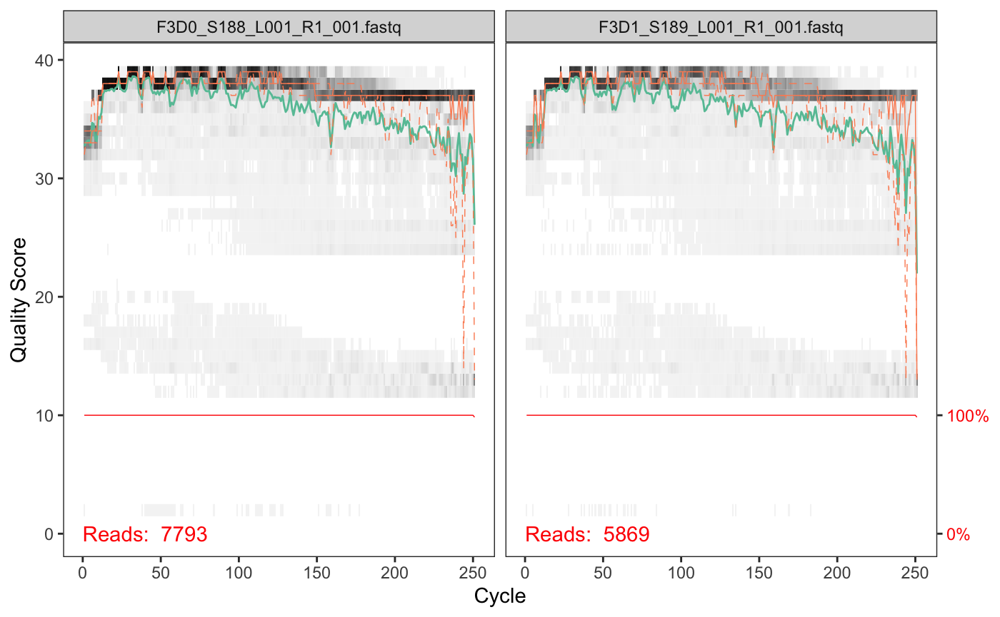
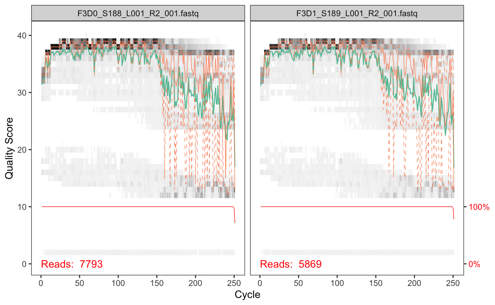
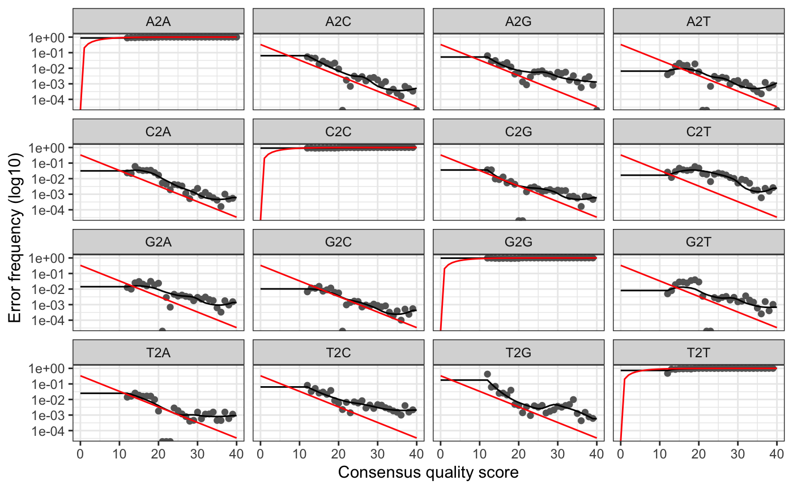
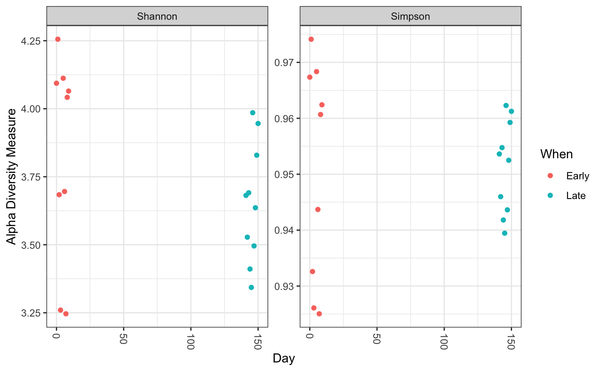
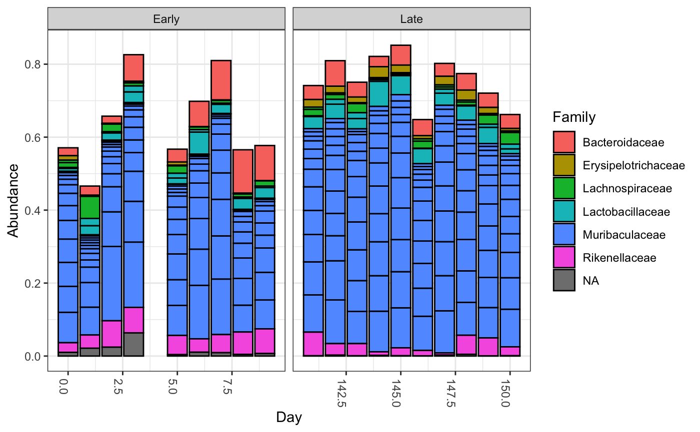

# **16S analysis with DADA2**
>This chapter contains a manual on 16S analysis with DADA2

## **Instruction**

You can run commands below in your `RStudio` in `R script`.<br>
Or if you want to write a beautiful & convenient to read laboratory journal you can use `R Markdown`.

----------------------------------------------

## **Step 1: Downloading the necessary packages and data**

First, let's download the necessary packages.<br>

**_Input_**

```r
if (!requireNamespace("BiocManager", quietly = TRUE))
    install.packages("BiocManager")
    
#BiocManager::install("dada2")
library(dada2)
```

Then let's set the working directory.<br>

**_Input_**

```r
main_dir <- dirname(rstudioapi::getSourceEditorContext()$path)
setwd(main_dir)
```

The data we will be working with are the same as those used in the mothur MiSeq SOP. The data can be downloaded here: https://mothur.s3.us-east-2.amazonaws.com/wiki/miseqsopdata.zip.<br>

Sometimes `R` does not like to download files. If it falls with error - download a zip archive manually and move it into working directory.<br>

**_Input_**

```r
url <- "https://mothur.s3.us-east-2.amazonaws.com/wiki/miseqsopdata.zip"

zipF<- "miseqsopdata.zip"

download.file(url, zipF)

outDir<-"miseqsopdata"

unzip(zipF,exdir=outDir)

if (file.exists(zipF)) {
  file.remove(zipF)
}
```

These are the results of sequencing 2x250 Illumina Miseq amplicons of the V4 region of the 16S rRNA gene from gut samples collected from mice after weaning. For now, these are just paired reads for us.<br>

Here we look at the contents of the folder and save the filenames of the forward and reverse reads as separate vectors (`forward.raw` and `reverse.raw`), distinguishing them by suffix. The last line creates a list of samples, removing all characters except the sample number.<br>

**_Input_**

```r
path <- 'miseqsopdata/MiSeq_SOP'
list.files(path)
fnFs <- sort(list.files(path, pattern="_R1_001.fastq", full.names = TRUE))
fnRs <- sort(list.files(path, pattern="_R2_001.fastq", full.names = TRUE))
sample.names <- sapply(strsplit(basename(fnFs), "_"), `[`, 1)
```

**_Output_**

```
 [1] "F3D0_S188_L001_R1_001.fastq"   "F3D0_S188_L001_R2_001.fastq"  
 [3] "F3D1_S189_L001_R1_001.fastq"   "F3D1_S189_L001_R2_001.fastq"  
 [5] "F3D141_S207_L001_R1_001.fastq" "F3D141_S207_L001_R2_001.fastq"
 [7] "F3D142_S208_L001_R1_001.fastq" "F3D142_S208_L001_R2_001.fastq"
 [9] "F3D143_S209_L001_R1_001.fastq" "F3D143_S209_L001_R2_001.fastq"
[11] "F3D144_S210_L001_R1_001.fastq" "F3D144_S210_L001_R2_001.fastq"
[13] "F3D145_S211_L001_R1_001.fastq" "F3D145_S211_L001_R2_001.fastq"
[15] "F3D146_S212_L001_R1_001.fastq" "F3D146_S212_L001_R2_001.fastq"
[17] "F3D147_S213_L001_R1_001.fastq" "F3D147_S213_L001_R2_001.fastq"
[19] "F3D148_S214_L001_R1_001.fastq" "F3D148_S214_L001_R2_001.fastq"
[21] "F3D149_S215_L001_R1_001.fastq" "F3D149_S215_L001_R2_001.fastq"
[23] "F3D150_S216_L001_R1_001.fastq" "F3D150_S216_L001_R2_001.fastq"
[25] "F3D2_S190_L001_R1_001.fastq"   "F3D2_S190_L001_R2_001.fastq"  
[27] "F3D3_S191_L001_R1_001.fastq"   "F3D3_S191_L001_R2_001.fastq"  
[29] "F3D5_S193_L001_R1_001.fastq"   "F3D5_S193_L001_R2_001.fastq"  
[31] "F3D6_S194_L001_R1_001.fastq"   "F3D6_S194_L001_R2_001.fastq"  
[33] "F3D7_S195_L001_R1_001.fastq"   "F3D7_S195_L001_R2_001.fastq"  
[35] "F3D8_S196_L001_R1_001.fastq"   "F3D8_S196_L001_R2_001.fastq"  
[37] "F3D9_S197_L001_R1_001.fastq"   "F3D9_S197_L001_R2_001.fastq"  
[39] "filtered"                      "HMP_MOCK.v35.fasta"           
[41] "Mock_S280_L001_R1_001.fastq"   "Mock_S280_L001_R2_001.fastq"  
[43] "mouse.dpw.metadata"            "mouse.time.design"            
[45] "stability.batch"               "stability.files"              
```

Now let's check the quality of the data. This function creates graphs similar to `FastQC` or `multiQC` graphs.<br>

**_Input_**

```r
plotQualityProfile(fnFs[1:2])
```

**_Output_**



We can do the same for reverse reads.<br>

**_Input_**

```r
plotQualityProfile(fnRs[1:2])
```

**_Output_**



Now we can filter by quality and trim reads based on the resulting graphs:<br>

**_Input_**

```r
filt_path <- file.path(path, "filtered")
filtFs <- file.path(filt_path, paste0(sample.names, "_F_filt.fastq.gz"))
filtRs <- file.path(filt_path, paste0(sample.names, "_R_filt.fastq.gz"))

out <- filterAndTrim(fnFs, filtFs, fnRs, filtRs, truncLen=c(240,160),
              maxN=0, maxEE=c(2,2), truncQ=2, rm.phix=TRUE,
              compress=TRUE, multithread=TRUE) # On Windows set multithread=FALSE

out
```

**_Output_**

```
                              reads.in reads.out
F3D0_S188_L001_R1_001.fastq       7793      7113
F3D1_S189_L001_R1_001.fastq       5869      5299
F3D141_S207_L001_R1_001.fastq     5958      5463
F3D142_S208_L001_R1_001.fastq     3183      2914
F3D143_S209_L001_R1_001.fastq     3178      2941
F3D144_S210_L001_R1_001.fastq     4827      4312
F3D145_S211_L001_R1_001.fastq     7377      6741
F3D146_S212_L001_R1_001.fastq     5021      4560
F3D147_S213_L001_R1_001.fastq    17070     15637
F3D148_S214_L001_R1_001.fastq    12405     11413
F3D149_S215_L001_R1_001.fastq    13083     12017
F3D150_S216_L001_R1_001.fastq     5509      5032
F3D2_S190_L001_R1_001.fastq      19620     18075
F3D3_S191_L001_R1_001.fastq       6758      6250
F3D5_S193_L001_R1_001.fastq       4448      4052
F3D6_S194_L001_R1_001.fastq       7989      7369
F3D7_S195_L001_R1_001.fastq       5129      4765
F3D8_S196_L001_R1_001.fastq       5294      4871
F3D9_S197_L001_R1_001.fastq       7070      6504
Mock_S280_L001_R1_001.fastq       4779      4314
```

----------------------------------------------

## **Step 2: Building an error model**

Evaluating the error model for the `DADA2` algorithm using direct reads.<br>

**_Input_**

```r
errF <- learnErrors(filtFs, multithread=TRUE)
```

**_Output_**

```
33514080 total bases in 139642 reads from 20 samples will be used for learning the error rates.
```

Same model for reverse reads.<br>

**_Input_**

```r
errR <- learnErrors(filtRs, multithread=TRUE)
```

**_Output_**

```
22342720 total bases in 139642 reads from 20 samples will be used for learning the error rates.
```

Error graph for all possible base transitions.<br>

**_Input_**

```r
plotErrors(errF, nominalQ=TRUE)
```

**_Output_**



----------------------------------------------

## **Step 3: Dereplication and "denoising"**

To speed up the calculations, we can remove identical sequences, taking into account their number in the subsequent analysis.<br>
For the obtained objects, we keep the same sample names.<br>

```r
derepFs <- derepFastq(filtFs, verbose=TRUE)
derepRs <- derepFastq(filtRs, verbose=TRUE)
# Name the derep-class objects by the sample names
names(derepFs) <- sample.names
names(derepRs) <- sample.names
```

Now we run the main algorithm to determine ASV for forward and reverse reads.<br>

```r
dadaFs <- dada(derepFs, err=errF, pool=T, multithread=TRUE) 
dadaRs <- dada(derepRs, err=errR, pool=T, multithread=TRUE)
```

**_Output_**

```
20 samples were pooled: 139642 reads in 23134 unique sequences.
20 samples were pooled: 139642 reads in 20631 unique sequences.
```

----------------------------------------------

## **Step 4: Merging reads, summary statistics**

Now we can "glue" the forward and reverse reads for each pair into one sequence.<br>

```r
mergers <- mergePairs(dadaFs, derepFs, dadaRs, derepRs, verbose=TRUE)

seqtab <- makeSequenceTable(mergers)
dim(seqtab)
```

**_Output_**

```
[1]  20 488
```

----------------------------------------------

## **Step 5: Removal of chimeras**

**_Input_**

```r
seqtab.nochim <- removeBimeraDenovo(seqtab, method="consensus", multithread=TRUE, verbose=TRUE)
dim(seqtab.nochim)
```

**_Output_**

```
Identified 204 bimeras out of 488 input sequences.
[1]  20 284
```

**_Input_**

```r
dim(seqtab.nochim)
sum(seqtab.nochim)/sum(seqtab)
```

**_Output_**

```
[1]  20 284
[1] 0.9180065
```

**_Input_**

```r
getN <- function(x) sum(getUniques(x))
track <- cbind(out, sapply(dadaFs, getN), sapply(dadaRs, getN), sapply(mergers, getN), rowSums(seqtab.nochim))
# If processing a single sample, remove the sapply calls: e.g. replace sapply(dadaFs, getN) with getN(dadaFs)
colnames(track) <- c("input", "filtered", "denoisedF", "denoisedR", "merged", "nonchim")
rownames(track) <- sample.names
head(track)
```

**_Output_**

```
       input filtered denoisedF denoisedR merged nonchim
F3D0    7793     7113      7077      7086   6758    6422
F3D1    5869     5299      5273      5283   5135    4992
F3D141  5958     5463      5427      5444   5166    4727
F3D142  3183     2914      2893      2904   2725    2432
F3D143  3178     2941      2922      2928   2761    2462
F3D144  4827     4312      4290      4301   4020    3515
```

----------------------------------------------

## **Step 6: Taxonomy identification**

To determine the taxonomic position of the found sequences, we first need to download the classifier.<br>
https://zenodo.org/record/1172783/files/silva_nr_v132_train_set.fa.gz.<br>

Sometimes `R` does not like to download files. If it falls with error - download a gz archive manually and move it into working directory.<br>

**_Input_**

```r
url <- "https://zenodo.org/record/1172783/files/silva_nr_v132_train_set.fa.gz"

classifier_1 <- "silva_nr_v132_train_set.fa.gz"

download.file(url, classifier_1)
```

A separate classifier will be required to identify species.<br>
https://zenodo.org/record/1172783/files/silva_species_assignment_v132.fa.gz?download=1.<br>

**_Input_**

```r
url <- "https://zenodo.org/record/1172783/files/silva_species_assignment_v132.fa.gz?download=1"

classifier_2 <- "silva_species_assignment_v132.fa.gz"

download.file(url, classifier_2)
```

**_Input_**

```r
taxa <- assignTaxonomy(seqtab.nochim, "silva_nr_v132_train_set.fa.gz", multithread=TRUE)
```

Adding Species Information.<br>

**_Input_**

```r
taxa <- addSpecies(taxa, "silva_species_assignment_v132.fa.gz", verbose=TRUE, allowMultiple=T)
```

**_Output_**

```
38 out of 284 were assigned to the species level.
Of which 33 had genera consistent with the input table.
```

**_Input_**

```r
taxa.print <- taxa # Removing sequence rownames for display only
rownames(taxa.print) <- NULL
head(taxa.print)
```

**_Output_***

```
     Kingdom    Phylum          Class         Order           Family          
[1,] "Bacteria" "Bacteroidetes" "Bacteroidia" "Bacteroidales" "Muribaculaceae"
[2,] "Bacteria" "Bacteroidetes" "Bacteroidia" "Bacteroidales" "Muribaculaceae"
[3,] "Bacteria" "Bacteroidetes" "Bacteroidia" "Bacteroidales" "Muribaculaceae"
[4,] "Bacteria" "Bacteroidetes" "Bacteroidia" "Bacteroidales" "Muribaculaceae"
[5,] "Bacteria" "Bacteroidetes" "Bacteroidia" "Bacteroidales" "Bacteroidaceae"
[6,] "Bacteria" "Bacteroidetes" "Bacteroidia" "Bacteroidales" "Muribaculaceae"
     Genus         Species                  
[1,] NA            NA                       
[2,] NA            NA                       
[3,] NA            NA                       
[4,] NA            NA                       
[5,] "Bacteroides" "acidifaciens/caecimuris"
[6,] NA            NA                       
```

----------------------------------------------

## **Step 7 (additional): Translation into `Phyloseq` format**

First, download the necessary packages.<br>

**_Input_**

```r
BiocManager::install("phyloseq")
```

**_Input_**

```r

library(phyloseq); packageVersion("phyloseq")
library(Biostrings); packageVersion("Biostrings")
library(ggplot2); packageVersion("ggplot2")
theme_set(theme_bw())

```

Then we add metadata.<br>

**_Input_**

```r
samples.out <- rownames(seqtab.nochim)
subject <- sapply(strsplit(samples.out, "D"), `[`, 1)
gender <- substr(subject,1,1)
subject <- substr(subject,2,999)
day <- as.integer(sapply(strsplit(samples.out, "D"), `[`, 2))
samdf <- data.frame(Subject=subject, Gender=gender, Day=day)
samdf$When <- "Early"
samdf$When[samdf$Day>100] <- "Late"
rownames(samdf) <- samples.out
```

And finally, we create a `phyloseq` object.<br>

**_Input_**

```r
ps <- phyloseq(otu_table(seqtab.nochim, taxa_are_rows=FALSE), 
               sample_data(samdf), 
               tax_table(taxa))
ps <- prune_samples(sample_names(ps) != "Mock", ps) # Remove mock sample
```

With it, you can already do any subsequent analysis. For example, calculate alpha diversity.<br>

**_Input_**

```r
plot_richness(ps, x="Day", measures=c("Shannon", "Simpson"), color="When")
```

**_Output_**



**_Input_**

```r
top20 <- names(sort(taxa_sums(ps), decreasing=TRUE))[1:20]
ps.top20 <- transform_sample_counts(ps, function(OTU) OTU/sum(OTU))
ps.top20 <- prune_taxa(top20, ps.top20)
plot_bar(ps.top20, x="Day", fill="Family") + facet_wrap(~When, scales="free_x")
```

**_Output_**

