# **Drawing Trees**
>This chapter contains a manual on drawing simple phylogenetic trees.

## **Instruction**
<br>


----------------------------------------------

## **Part 1: Language - `R`**

### **Part 1.1: `library(ape)`**

#### **Step 1: Read tree `(((A,B),(C,D)),E);` from text into `simpletree` object**

**_Input_**

```r
simpletree <- read.tree(text = "(((A,B), (C,D)), E);")
```

#### **Step 2: Draw `simpletree` using standard function from `ape` package**

**_Input_**

```r
plot.phylo(simpletree)
```

**_Output_**

<div style='justify-content: center'>
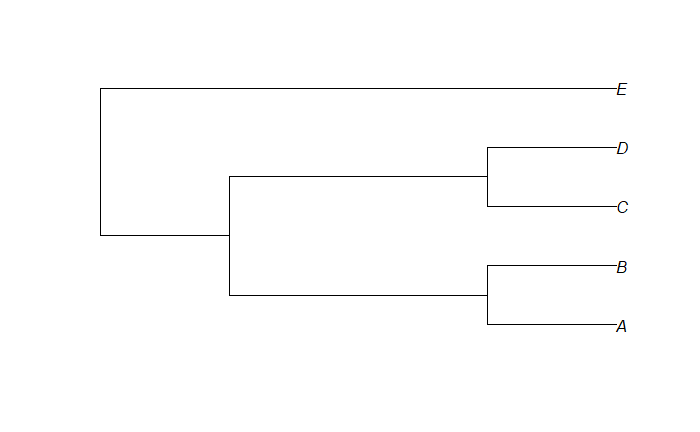
</div>

#### **Step 3: Save this tree in raster format (png) and vector format (svg or pdf)**

**_Input_**

```r
png("simpletree.png")
plot.phylo(simpletree)
dev.off()

svg("simpletree.svg", width = 4, height = 4)
plot.phylo(simpletree)
dev.off()
```

#### **Step 4: Read the file https://www.jasondavies.com/tree-of-life/life.txt into the `treeoflife` object**

**_Input_**

```r
treeoflife <- read.tree("https://www.jasondavies.com/tree-of-life/life.txt")
```

#### **Step 5: Draw a `treeoflife` using a standard function from the `ape` package and save this tree in any format we like**

**_Input_**

```r
plot.phylo(treeoflife, cex = 0.2)

png(filename = "treeOfLife.png", width = 20, height = 20, units = "cm", res = 600)
plot.phylo(treeoflife, cex = 0.2)
dev.off()
```

**_Output_**

<div style='justify-content: center'>
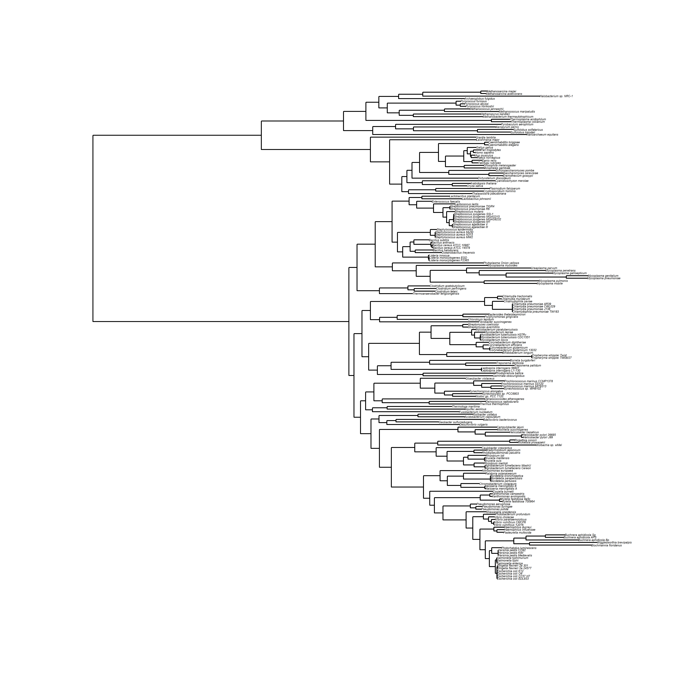
</div>

#### **Step 6: Draw `treeoflife` unrooted or circular**

**_Input_**

```r
plot.phylo(treeoflife, type = "unrooted", no.margin = T, cex = 0.2)

plot.phylo(treeoflife, type = "radial", cex = 0.2)
```

**_Output_**

<div style='justify-content: center'>
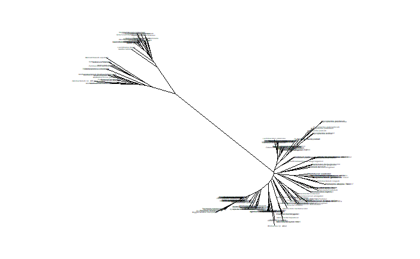
</div>

<div style='justify-content: center'>
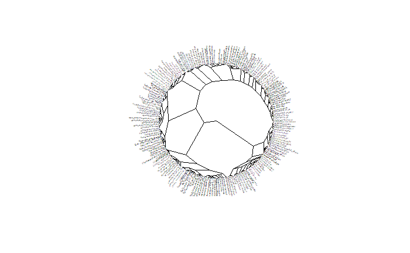
</div>

----------------------------------------------

### **Part 1.2: `library(ggtree)`**

#### **Step 7: Draw treeoflife using `ggtree` with minimal settings**

**_Input_**

```r
treeoflife_text <- readLines("https://www.jasondavies.com/tree-of-life/life.txt")

treeoflife <- ggtree::read.tree(text = treeoflife_text)
ggtree(treeoflife)
```

**_Output_**

<div style='justify-content: center'>
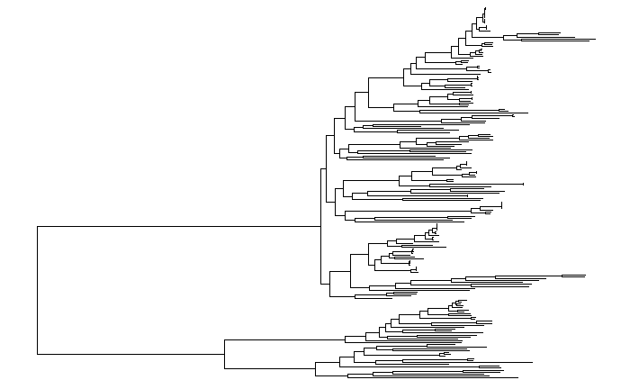
</div>

#### **Step 8: Draw treeoflife with `ggtree` so that the inscriptions are readable**

**_Input_**

```r
ggtree(treeoflife) + geom_tiplab(size = 1)
```

**_Output_**

<div style='justify-content: center'>
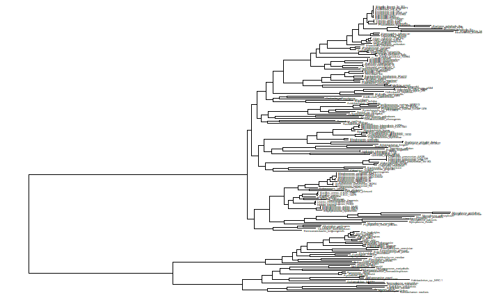
</div>

#### **Step 9: Draw treeoflife in a circular shape with readable inscriptions**

**_Input_**

```r
ggtree(treeoflife) + layout_circular() + geom_tiplab(size = 2)
```

**_Output_**

<div style='justify-content: center'>
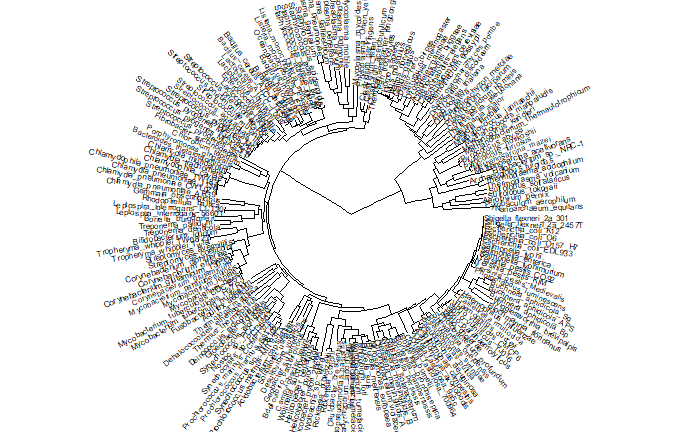
</div>
   
#### **Step 10: Draw treeoflife with additional highlighting of some part of it**

**_Input_**

```r
treeoflife <- groupOTU(treeoflife, c("Homo_sapiens", "Pan_troglodytes"))
ggtree(treeoflife) + layout_circular() +
  geom_tiplab2(size = 2) + geom_tippoint(aes(alpha = group), col = "red") +
  scale_color_manual(values = c(0,1), aesthetics = "alpha") +
  theme(legend.position = 'null')
```

**_Output_**

<div style='justify-content: center'>
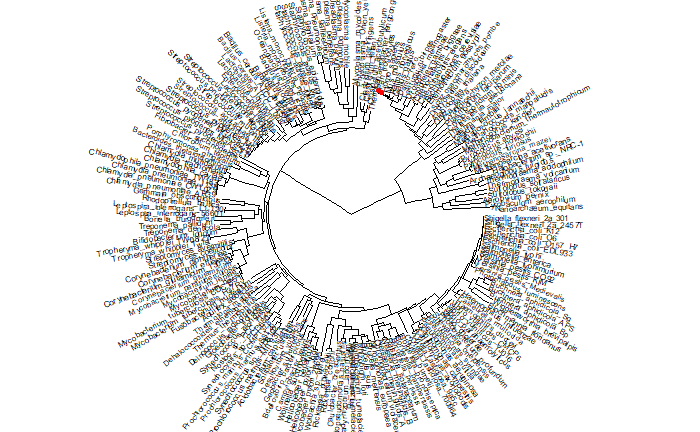
</div>

----------------------------------------------

## **Part 2: Language - `Python`**

### **Part 2.1:  `Bio::Phylo`**

**_Input_**

```python
import random
from io import StringIO

import matplotlib
import requests
from Bio import Phylo
from ete3 import Tree, TreeStyle, NodeStyle
```

#### **Step 11: Read the tree https://www.jasondavies.com/tree-of-life/life.txt**

**_Input_**

```python
raw_tree = StringIO(requests.get('https://www.jasondavies.com/tree-of-life/life.txt').text)
tree1 = Phylo.read(raw_tree, "newick")
```

#### **Step 12: Draw this tree with pseudo-graphics (draw_ascii)**

**_Input_**

```python
Phylo.draw_ascii(tree1)
```

**_Output_**

```
                             , Escherichia_coli_EDL933
                             |
                             | Escherichia_coli_O157_H7
                             |
                             , Escherichia_coli_O6
                             |
                             | Escherichia_coli_K12
                             |
                             , Shigella_flexneri_2a_2457T
                             |
                             | Shigella_flexneri_2a_301
                             |
                             , Salmonella_enterica
                             |
                             | Salmonella_typhi
                             |
                             | Salmonella_typhimurium
                             |
                             , Yersinia_pestis_Medievalis
                             |
                             , Yersinia_pestis_KIM
                             |
                            ,| Yersinia_pestis_CO92
                            ||
                            || Photorhabdus_luminescens
                            ||
                            ||   ___ Blochmannia_floridanus
                            || ,|
                            || ||____ Wigglesworthia_brevipalpis
                            ||_|
                            |  |___ Buchnera_aphidicola_Bp
                            |  |
                            |  | , Buchnera_aphidicola_APS
                            |  |_|
                            |    | Buchnera_aphidicola_Sg
                            |
                            |, Pasteurella_multocida
                            ||
                            || Haemophilus_influenzae
                           ,||
                           ||| Haemophilus_ducreyi
                           ||
                           ||, Vibrio_vulnificus_YJ016
                           |||
                           ||| Vibrio_vulnificus_CMCP6
                          ,|||
                          ||,| Vibrio_parahaemolyticus
                          ||||
                          |||| Vibrio_cholerae
                          |||
                         ,||| Photobacterium_profundum
                         |||
                         |||_ Shewanella_oneidensis
                         ||
                         || , Pseudomonas_putida
                         ||,|
                         |||| Pseudomonas_syringae
                         | |
                         | | Pseudomonas_aeruginosa
                         |
                         |    , Xylella_fastidiosa_700964
                         |   _|
                        ,|  | | Xylella_fastidiosa_9a5c
                        ||__|
                        ||  |, Xanthomonas_axonopodis
                        ||  ||
                        ||   | Xanthomonas_campestris
                        ||
                        ||___ Coxiella_burnetii
                        |
                       _|   , Neisseria_meningitidis_A
                      | |  ,|
                      | | ,|| Neisseria_meningitidis_B
                      | | ||
                      | | || Chromobacterium_violaceum
                      | |,|
                      | |||  , Bordetella_pertussis
                      | ||| _|
                      | |||| , Bordetella_parapertussis
                      | |||| |
                      |  | | | Bordetella_bronchiseptica
                      |  | |
                      |  | |_ Ralstonia_solanacearum
                      |  |
                      |  |__ Nitrosomonas_europaea
                     ,|
                     ||      , Agrobacterium_tumefaciens_Cereon
                     ||     ,|
                     ||    ,|| Agrobacterium_tumefaciens_WashU
                     ||    ||
                     ||    || Rhizobium_meliloti
                     ||   ,|
                     ||   ||, Brucella_suis
                     ||   |,|
                     ||   ||| Brucella_melitensis
                     ||  ,||
                     ||  |||_ Rhizobium_loti
                     ||  ||
                     || _|| , Rhodopseudomonas_palustris
                     ||| ||_|
                    ,||| |  | Bradyrhizobium_japonicum
                    |||| |
                    || | |__ Caulobacter_crescentus
                    || |
                    || |  ______ Wolbachia_sp._wMel
                    || |_|
                    ||   |    , Rickettsia_prowazekii
                    ||   |____|
                    ||        | Rickettsia_conorii
                    ||
                    ||         , Helicobacter_pylori_J99
                    ||        _|
                    ||      ,| | Helicobacter_pylori_26695
                    ||      ||
                    ||     ,|| Helicobacter_hepaticus
                    ||     ||
                    ||_____|| Wolinella_succinogenes
                    |      |
                    |      |_ Campylobacter_jejuni
                    |
                    | _____ Desulfovibrio_vulgaris
                    ||
                    || __ Geobacter_sulfurreducens
                    |||
                    |||_____ Bdellovibrio_bacteriovorus
                   ,||
                   |||   __ Acidobacterium_capsulatum
                   |||__|
                   ||   |___ Solibacter_usitatus
                   ||
                   ||______ Fusobacterium_nucleatum
                   ||
                   ||  ____ Aquifex_aeolicus
                   ||_|
                   || |___ Thermotoga_maritima
                   ||
                   ||     __ Thermus_thermophilus
                   || ___|
                   |||   |___ Deinococcus_radiodurans
                   |||
                   |||______ Dehalococcoides_ethenogenes
                   |||
                   |||     _ Nostoc_sp._PCC_7120
                   |||    |
                   |||   ,|_ Synechocystis_sp._PCC6803
                   |||   ||
                   | |   || Synechococcus_elongatus
                   | |   |
                   | |  ,|   , Synechococcus_sp._WH8102
                   | |  ||  ,|
                   | |  ||  || Prochlorococcus_marinus_MIT9313
                   | |  ||  |
                   | |__||__|_ Prochlorococcus_marinus_SS120
                   |    |   |
                   |    |   |_ Prochlorococcus_marinus_CCMP1378
                   |    |
                   |    |__ Gloeobacter_violaceus
                   |
                   |     ____ Gemmata_obscuriglobus
                   |  __|
                   | |  |____ Rhodopirellula_baltica
                   | |
                   |,|      , Leptospira_interrogans_L1-130
                   ||| _____|
                   ||||     | Leptospira_interrogans_56601
                   ||||
                   || |     ___ Treponema_pallidum
                   || |   _|
                   || |__| |_ Treponema_denticola
                   ||    |
                   ||    |____ Borrelia_burgdorferi
                   ||
                   ||           , Tropheryma_whipplei_TW08/27
                   ||      _____|
                   ||    _|     | Tropheryma_whipplei_Twist
                   ||   | |
                   ||   | |___ Bifidobacterium_longum
                   ||   |
                   ||   |    , Corynebacterium_glutamicum_13032
                   ||   |   ,|
                   ||   |   || Corynebacterium_glutamicum
                   ||   |   |
                   ||___|  _| Corynebacterium_efficiens
                   ||   | | |
                   ||   | | | Corynebacterium_diphtheriae
                   ||   | |
                   ||   |,| , Mycobacterium_bovis
                   ||   ||| |
                   ||   ||| , Mycobacterium_tuberculosis_CDC1551
                   ||   ||| |
                   ||   ||| | Mycobacterium_tuberculosis_H37Rv
                   ||   |||_|
                   ||    |  | Mycobacterium_leprae
                   ||    |  |
                   ||    |  | Mycobacterium_paratuberculosis
                   ||    |
                   ||    | , Streptomyces_avermitilis
                   ||    |_|
                   ||      | Streptomyces_coelicolor
  _________________||
 |                 || ______ Fibrobacter_succinogenes
 |                 |,|
 |                 ||| ____ Chlorobium_tepidum
 |                 ||||
 |                 || |    , Porphyromonas_gingivalis
 |                 || |____|
 |                 ||      |_ Bacteroides_thetaiotaomicron
 |                 ||
 |                 ||         , Chlamydophila_pneumoniae_TW183
 |                 ||        ,|
 |                 ||        |, Chlamydia_pneumoniae_J138
 |                 ||        ||
 |                 ||       ,|, Chlamydia_pneumoniae_CWL029
 |                 ||       |||
 |                 ||       ||| Chlamydia_pneumoniae_AR39
 |                 ||_______||
 |                 |        || Chlamydophila_caviae
 |                 |        |
 |                 |        |, Chlamydia_muridarum
 |                 |        ||
 |                 |         | Chlamydia_trachomatis
 |                 |
 |                 |  _ Thermoanaerobacter_tengcongensis
 |                 | |
 |                 |_|  _ Clostridium_tetani
 |                 | | |
 |                 | |_|_ Clostridium_perfringens
 |                 |   |
 |                 |   |_ Clostridium_acetobutylicum
 |                 |
 |                 |         ___ Mycoplasma_mobile
 |                 |      __|
 |                 |     |  |___ Mycoplasma_pulmonis
 |                 |     |
 |                 |     |         _ Mycoplasma_pneumoniae
 |                 |    ,|     ___|
 |                 |    ||   _|   |_ Mycoplasma_genitalium
 |                 |    ||  | |
 |                 |    || ,| |__ Mycoplasma_gallisepticum
 |                 |   _|| ||
 |                 |  | ||_||____ Mycoplasma_penetrans
 |                 |  | |  |
 |                 | ,| |  |____ Ureaplasma_parvum
 |                 | || |
 |                 | || |____ Mycoplasma_mycoides
 |                 | ||
 |                 | ||_____ Phytoplasma_Onion_yellows
 |                 | |
 |                 | |   , Listeria_monocytogenes_F2365
 |                 | |  ,|
 |                 | | ,|| Listeria_monocytogenes_EGD
 |                 | | ||
 |                 | | || Listeria_innocua
 |                 | | |
 |                 | |,|, Oceanobacillus_iheyensis
 |                 | ||,|
 |                 | |||| Bacillus_halodurans
 |                 | |||
 |                 | ||| , Bacillus_cereus_ATCC_14579
 |                 |_||| |
 |                   |||_| Bacillus_cereus_ATCC_10987
 |                   ||| |
 |                   ||| | Bacillus_anthracis
 |                   |||
 |                   |||_ Bacillus_subtilis
 |                   ||
 |                   ||  , Staphylococcus_aureus_MW2
 |                   ||  |
 |                   ||  , Staphylococcus_aureus_N315
 |                   ||__|
 |                   ||  | Staphylococcus_aureus_Mu50
 |                   ||  |
_|                   ||  | Staphylococcus_epidermidis
 |                   ||
 |                   ||   , Streptococcus_agalactiae_III
 |                   ||   |
 |                   ||   | Streptococcus_agalactiae_V
 |                   ||   |
 |                    |   , Streptococcus_pyogenes_M1
 |                    |   |
 |                    |   , Streptococcus_pyogenes_MGAS8232
 |                    |   |
 |                    |   , Streptococcus_pyogenes_MGAS315
 |                    |   |
 |                    |   | Streptococcus_pyogenes_SSI-1
 |                    |  ,|
 |                    |  || Streptococcus_mutans
 |                    |  ||
 |                    | ,|, Streptococcus_pneumoniae_R6
 |                    | |||
 |                    | ||| Streptococcus_pneumoniae_TIGR4
 |                    |,||
 |                    |||| Lactococcus_lactis
 |                    |||
 |                    ||| Enterococcus_faecalis
 |                     |
 |                     | __ Lactobacillus_johnsonii
 |                     ||
 |                      |_ Lactobacillus_plantarum
 |
 |                      ____ Thalassiosira_pseudonana
 |                     |
 |                     |  __ Cryptosporidium_hominis
 |                     |_|
 |                     | |___ Plasmodium_falciparum
 |                     |
 |                     |  , Oryza_sativa
 |                    ,| _|
 |                    |,| | Arabidopsis_thaliana
 |                    |||
 |                    |||____ Cyanidioschyzon_merolae
 |                    ||
 |                    ||____ Dictyostelium_discoideum
 |                    ||
 |                    ||     , Eremothecium_gossypii
 |                    ||   __|
 |                    || _|  | Saccharomyces_cerevisiae
 |                    ||| |
 |                    ||| |__ Schizosaccharomyces_pombe
 |                    |||
 |                    |||  , Anopheles_gambiae
 |                    ||| ,|
 |                    ||| || Drosophila_melanogaster
 |                    ||| |
 |                   _||| | , Takifugu_rubripes
 |                  | | |,|,|
 |                  | | ||||| Danio_rerio
 |                  | | ||||
 |                  | | ||||, Rattus_norvegicus
 |                  | | |||,|
 |                  | | || || Mus_musculus
 |                  | | || |
 |                  | | || |, Homo_sapiens
 |                  | |  | ||
 |            ______| |  | || Pan_troglodytes
 |           |      | |  | |
 |           |      | |  | | Gallus_gallus
 |           |      | |  |
 |           |      | |  |  , Caenorhabditis_elegans
 |           |      | |  |__|
 |           |      | |     | Caenorhabditis_briggsae
 |           |      | |
 |           |      | |_____ Leishmania_major
 |           |      |
 |           |      |_______ Giardia_lamblia
 |___________|
             |       __________ Nanoarchaeum_equitans
             |      |
             |      |        _ Sulfolobus_tokodaii
             |     _|   ____|
             |    | | ,|    |__ Sulfolobus_solfataricus
             |    | | ||
             |    | |_||_____ Aeropyrum_pernix
             |    |   |
             |    |   |_______ Pyrobaculum_aerophilum
             |    |
             |____|          , Thermoplasma_volcanium
                  |  ________|
                  | |        | Thermoplasma_acidophilum
                  | |
                  | |   ____ Methanobacterium_thermautotrophicum
                  | | ,|
                  | | ||____ Methanopyrus_kandleri
                  |_| |
                    | |    __ Methanococcus_maripaludis
                    | |___|
                    |,|   | Methanococcus_jannaschii
                    |||
                    |||    , Pyrococcus_horikoshii
                    |||   ,|
                    |||___|| Pyrococcus_abyssi
                     |    |
                     |    | Pyrococcus_furiosus
                     |
                     | ____ Archaeoglobus_fulgidus
                     ||
                      |  _______ Halobacterium_sp._NRC-1
                      |_|
                        |   , Methanosarcina_acetivorans
                        |___|
                            | Methanosarcina_mazei
```

#### **Step 13: Draw a tree with draw**

**_Input_**

```python
Phylo.draw(tree1, do_show = False)
```

**_Output_**

<div style='justify-content: center'>

</div>

#### **Step 14: Save the tree image in raster (png) and vector (svg/pdf) formats**

**_Input_**

```python
Phylo.draw(tree1, do_show = False)
matplotlib.pyplot.savefig("py_tree1_phylo.png")
matplotlib.pyplot.savefig("py_tree1_phylo.pdf")
```

**_Output_**

<div style='justify-content: center'>
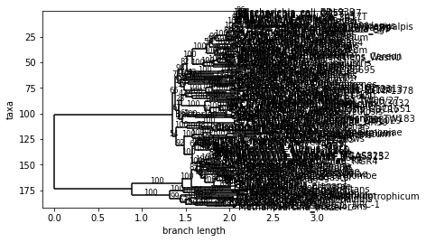
</div>

#### **Step 15: Draw the tree in a more or less readable form**

**_Input_**

```python
matplotlib.rc('font', size=1) matplotlib.pyplot.figure(figsize=(24,12))
Phylo.draw(tree1, do_show = False) matplotlib.pyplot.savefig("py_tree1_phylo_enhanced.png", dpi=600)
```

**_Output_**

<div style='justify-content: center'>
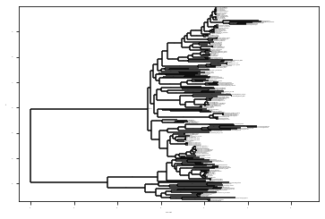
</div>

----------------------------------------------

## **Part 2.2: `Python: ETE (ETE3)`**

#### **Step 16: Read a simple tree (((A,B),(C,D)),E) from the text**

**_Input_**

```python
simpletree = Tree("(((A,B), (C,D)), E);")
```

#### **Step 17: Save this tree to a file**

**_Input_**

```python
simpletree.render("simpletree.png", w=183, units="mm") ;
```

**_Output_**

<div style='justify-content: center'>
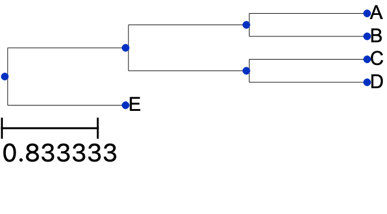
</div>

#### **Step 18: Read the tree https://www.jasondavies.com/tree-of-life/life.txt and draw this tree with default settings**

**_Input_**

```python
raw_tree = requests.get('https://www.jasondavies.com/tree-of-life/life.txt').text tree2 = Tree(raw_tree, format=1)
tree2.render("py_tree2_ete3.pdf") ;
```

**_Output_**

<div style='justify-content: center'>
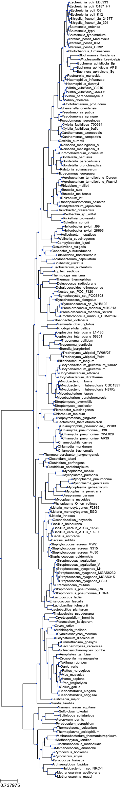
</div>

#### **Step 19: Draw this tree circular**

**_Input_**

```python
circular_style = TreeStyle()
circular_style.mode = "c"
circular_style.scale = 20
tree2.render("py_tree2_ete3_circ.pdf", tree_style=circular_style) ;
```

**_Output_**

<div style='justify-content: center'>
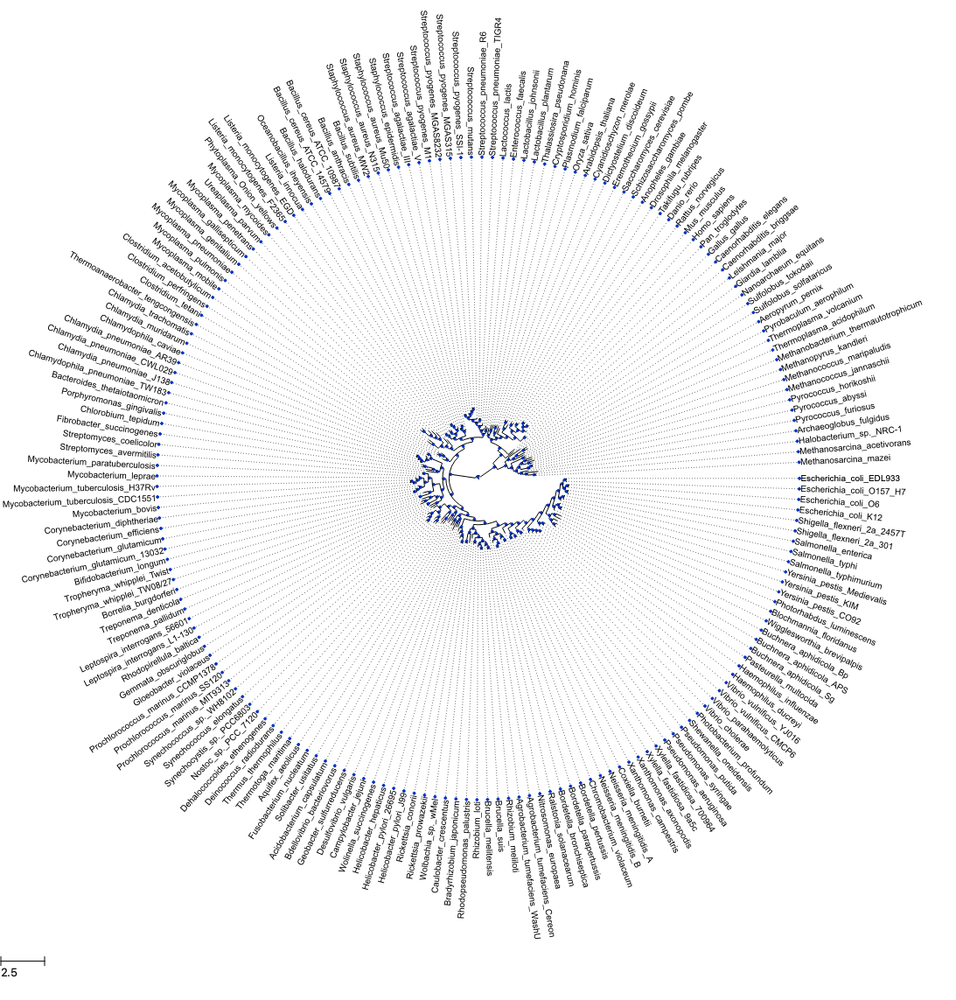
</div>

#### **Step 20: Draw this treeoflife with additional highlighting of some part of your choice**

**_Input_**

```python
nst1 = NodeStyle()
nst1["bgcolor"] = "LightSteelBlue"
n1 = tree2.get_common_ancestor("Homo_sapiens", "Danio_rerio") n1.set_style(nst1)
tree2.render("py_tree2_ete3_vertebrates.png", tree_style=circular_style) ;
```

**_Output_**

<div style='justify-content: center'>
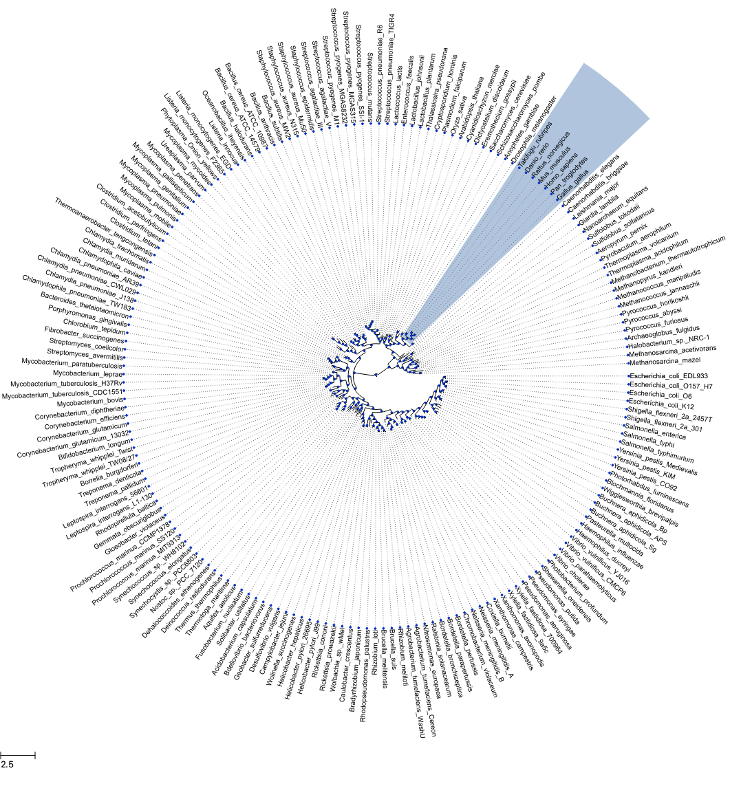
</div>