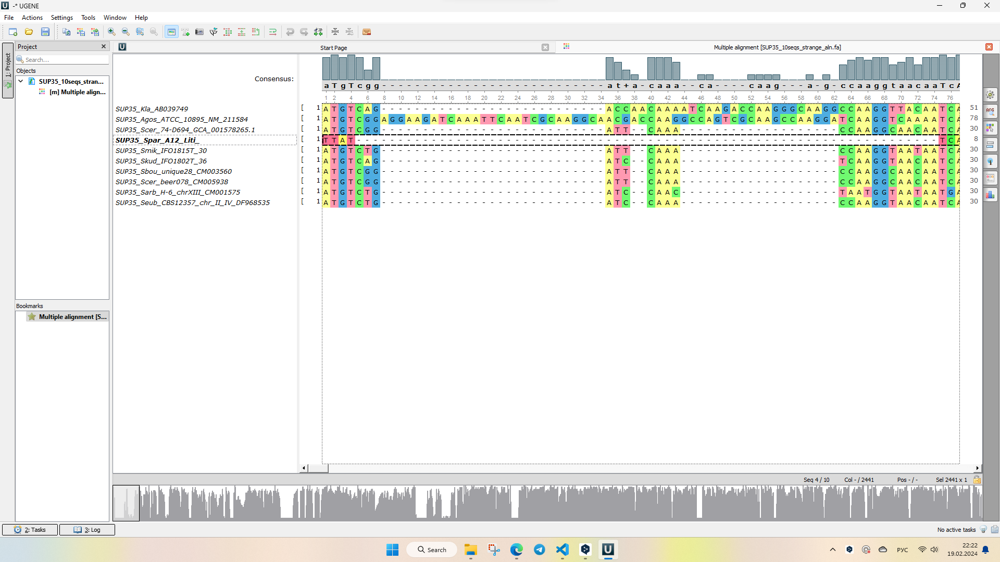
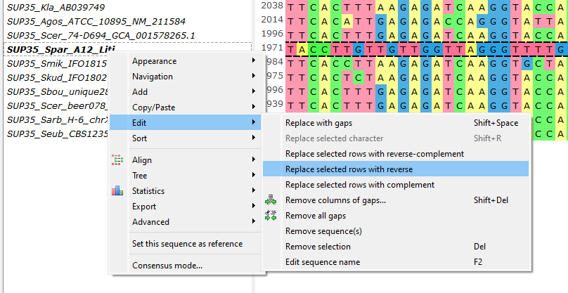
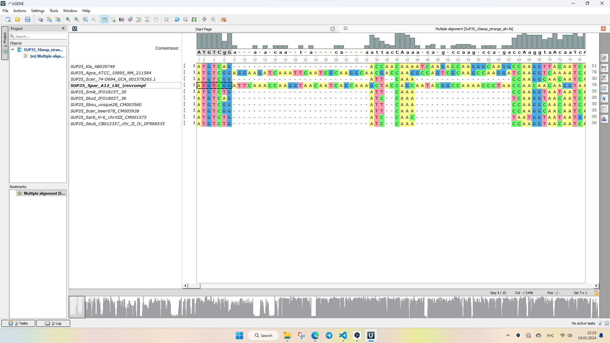

# **Multiple Sequence Alignment**

>This chapter contains a manual on aligning multiple sequences at once.<br>

## **Instruction**
<br>


???+ question
    Where to get the data?

Download it from GitHub repository:

```bash
wget https://github.com/ilypopv/NGS-Handbook/raw/refs/heads/main/data/04_Phylogenetics/04_03_MSA.zip
```

```bash
unzip 04_03_MSA.zip && rm -rf 04_03_MSA.zip
```

>For this work, we will use the alignments of [SUP35 gene](https://www.yeastgenome.org/locus/S000002579).<br>

As we will be working with several tools we will compare them.<br>
We will compare them based on:<br>

- Running time.<br>
- Alignment length.<br>

These are not the best metrics to compare the alignments. Yet for the purposes of this manual they do well.<br>

----------------------------------------------

## **Step 1: Run 6 possible alignment algorithms for 10 DNA sequences**

**_Input_**

=== "`clustalw`"

    ``` bash
    time clustalw -INFILE=data/SUP35_10seqs.fa \
        -OUTPUT=FASTA \
        -OUTFILE=10_DNA_seqs/02_SUP35_10seqs.clustalw.fa
    ```

=== "`muscle`"

    ``` bash
    time muscle -align data/SUP35_10seqs.fa \
        -output 10_DNA_seqs/02_SUP35_10seqs_muscle.fa
    ```
=== "`mafft`"

    ``` bash
    time mafft --auto data/SUP35_10seqs.fa >\
        10_DNA_seqs/02_SUP35_10seqs_mafft.fa
    ```
=== "`kalign`"

    ``` bash
    time kalign <data/SUP35_10seqs.fa >\
        10_DNA_seqs/02_SUP35_10seqs_kalign.fa
    ```

=== "`t_coffee`"

    ``` bash
    time t_coffee -infile=data/SUP35_10seqs.fa \
        -outfile=10_DNA_seqs/02_SUP35_10seqs_tcoffee.fa \
        -output=fasta_aln
    ```
=== "`prank`"

    ``` bash
    time prank -d=data/SUP35_10seqs.fa \
        -o=10_DNA_seqs/02_SUP35_10seqs_prank.fa \
        -codon
    ```

Now let's use a simple script to assess the alignment length.<br>

**_Input_**

```python
from Bio import AlignIO
import os
```

**_Input_**

```python
folder_path = '10_DNA_seqs'
alignment_files = [os.path.join(folder_path, file) for file in os.listdir(folder_path) if file.endswith('.fa')]

for file in alignment_files:
    alignment = AlignIO.read(file, 'fasta')
    alignment_length = alignment.get_alignment_length()
    print(f"Alignment length in file {file}: {alignment_length}")
```

**_Output_**

```
Alignment length in file 10_DNA_seqs/02_SUP35_10seqs_tcoffee.fa: 2210
Alignment length in file 10_DNA_seqs/02_SUP35_10seqs_mafft.fa: 2166
Alignment length in file 10_DNA_seqs/02_SUP35_10seqs.clustalw.fa: 2148
Alignment length in file 10_DNA_seqs/02_SUP35_10seqs_kalign.fa: 2152
Alignment length in file 10_DNA_seqs/02_SUP35_10seqs_muscle.fa: 2333
```

### **Comparative table**

???+ question
    Which algorithm is better to use?

|Tool|Time|Alignment length|
|----|----|----------------|
|`clustalw`|5.641 s|2148|
|`muscle`|5.009 s|2333|
|`mafft`|4.382 s|2166|
|`kalign`|0.475 s|2152|
|`t_coffee`|20.869 s|2210|
|`prank`|>10 min|NA|

???+ success
    It's best to use `muscle`!

### **How to fix the alignment**

???+ question
    What's wrong with the alignment of `SUP35_10seqs_strange_aln.fa` and how to fix it?

Let's take a look at this alignment in `UGENE`

<div style='justify-content: center'>

</div>

It can be seen that the sequence `SUP35_Spar_A12_Liti_` is strange. Most likely it is a reverse, i.e. it is reverse complementary.

Let's do a couple of youtz, youtz, youtz.

<div style='justify-content: center'>

</div>

<div style='justify-content: center'>

</div>

It's beautiful!

----------------------------------------------

## **Step 2: Run 6 possible alignment algorithms for 250 DNA sequences**

**_Input_**

=== "`clustalw`"

    ``` bash
    time clustalw -INFILE=data/SUP35_250seqs.fa \
        -OUTPUT=FASTA \
        -OUTFILE=250_DNA_seqs/05_SUP35_250seqs.clustalw.fa
    ```

=== "`muscle`"

    ``` bash
    time muscle -align data/SUP35_250seqs.fa \
        -output 250_DNA_seqs/05_SUP35_250seqs_muscle.fa
    ```
=== "`mafft`"

    ``` bash
    time mafft --auto data/SUP35_250seqs.fa >\
        250_DNA_seqs/05_SUP35_250seqs_mafft.fa
    ```
=== "`kalign`"

    ``` bash
    time kalign <data/SUP35_250seqs.fa >\
        250_DNA_seqs/05_SUP35_250seqs_kalign.fa
    ```

=== "`t_coffee`"

    ``` bash
    time t_coffee -infile=data/SUP35_250seqs.fa \
        -outfile=250_DNA_seqs/05_SUP35_250seqs_tcoffee.fa \
        -output=fasta_aln
    ```
=== "`prank`"

    ``` bash
    time prank -d=data/SUP35_250seqs.fa \
        -o=250_DNA_seqs/05_SUP35_250seqs_prank.fa \
        -codon
    ```

Now let's use a simple script to assess the alignment length.<br>

**_Input_**

```python
folder_path = '250_DNA_seqs'
alignment_files = [os.path.join(folder_path, file) for file in os.listdir(folder_path) if file.endswith('.fa')]

for file in alignment_files:
    alignment = AlignIO.read(file, 'fasta')
    alignment_length = alignment.get_alignment_length()
    print(f"Alignment length in file {file}: {alignment_length}")
```

**_Output_**

```
Alignment length in file 250_DNA_seqs/05_SUP35_250seqs.clustalw.fa: 2179
Alignment length in file 250_DNA_seqs/05_SUP35_250seqs_mafft.fa: 2322
Alignment length in file 250_DNA_seqs/05_SUP35_250seqs_muscle.fa: 2365
Alignment length in file 250_DNA_seqs/05_SUP35_250seqs_kalign.fa: 2210
```

### **Comparative table**

???+ question
    Has our choice of algorithm changed?

|Tool|Time|Alignment length|
|----|----|----------------|
|`clustalw`|48:41.97 min|2179|
|`muscle`|30:44.42 min|2365|
|`mafft`|41.962 s|2322|
|`kalign`|7.996 s|2210|
|`t_coffee`|>1 h|NA|
|`prank`|>1 h|NA|

???+ succes
    All the sympathies are on the side of `kalign` for the reason that it aligned 250 sequences in 8 seconds.<br>
    But to be fair, `mafft` is not bad either. Its alignment is longer, and its working time is 42 seconds, not 30 or 48 minutes...<br>

## **Step 2.5: How to get amino acid sequences from nucleotide sequences (translate)?**

### **Option 1: `transeq`**

The simplest and fastest variant. With its help, we "stupidly" do the translation starting from the first nucleotide and up to the last one.

**_Input_**

```bash
transeq -sequence data/SUP35_10seqs.fa -outseq data/SUP35_10seqs.t.faa
```

### **Option 2: `getorf`**

`getorf` operates based on the assumption that it was given a sequence that has an open reading frame.<br>
`getorf` is not highly intelligent.<br>
Anything that starts with a methionine and ends with a stop codon is an open reading frame!<br>
It needs to tune our representation, otherwise we get a bunch of junk. Especially in fairly long sequences.<br>
But if we know how long this junk should be and we need to predict proteins quickly from our data of some Sanger sequencing, it is a very good option!<br>

**_Input_**

```bash
getorf -sequence data/SUP35_10seqs.fa -outseq data/SUP35_10seqs.g.faa -noreverse -minsize 500
```

----------------------------------------------

## **Step 3: Run 7 possible alignment algorithms for 10 protein sequences**

**_Input_**

=== "`clustalw`"

    ``` bash
    time clustalw -INFILE=data/SUP35_10seqs.g.faa \
        -OUTFILE=10_protein_seqs/08_SUP35_10seqs.clustalw.faa \
        -OUTPUT=FASTA \
        -TYPE=protein
    ```

=== "`clustalo`"

    ``` bash
    time clustalo --infile=data/SUP35_10seqs.g.faa \
        --outfile=10_protein_seqs/08_SUP35_10seqs.clustalo.faa \
        --verbose
    ```

=== "`muscle`"

    ``` bash
    time muscle -align data/SUP35_10seqs.g.faa \
        -output 10_protein_seqs/08_SUP35_10seqs_muscle.faa
    ```
=== "`mafft`"

    ``` bash
    time mafft --auto data/SUP35_10seqs.g.faa >\
        10_protein_seqs/08_SUP35_250seqs_mafft.fa
    ```
=== "`kalign`"

    ``` bash
    time kalign <data/SUP35_10seqs.g.faa >\
        10_protein_seqs/08_SUP35_10seqs_kalign.faa
    ```

=== "`t_coffee`"

    ``` bash
    time t_coffee -infile=data/SUP35_10seqs.g.faa \
        -outfile=10_protein_seqs/08_SUP35_10seqs_tcoffee.faa \
        -output=fasta_aln
    ```
=== "`prank`"

    ``` bash
    time prank -d=data/SUP35_10seqs.g.faa \
        -o=10_protein_seqs/08_SUP35_10seqs_prank.faa
    ```

Now let's use a simple script to assess the alignment length.<br>

**_Input_**

```python
folder_path = '10_protein_seqs'
alignment_files = [os.path.join(folder_path, file) for file in os.listdir(folder_path) if file.endswith('.fa') | file.endswith('.faa') | file.endswith('.fas')]

for file in alignment_files:
    alignment = AlignIO.read(file, 'fasta')
    alignment_length = alignment.get_alignment_length()
    print(f"Alignment length in file {file}: {alignment_length}")
```

**_Output_**

```
Alignment length in file 10_protein_seqs/08_SUP35_250seqs_mafft.fa: 759
Alignment length in file 10_protein_seqs/08_SUP35_10seqs_muscle.faa: 765
Alignment length in file 10_protein_seqs/08_SUP35_10seqs_kalign.faa: 721
Alignment length in file 10_protein_seqs/08_SUP35_10seqs_tcoffee.faa: 752
Alignment length in file 10_protein_seqs/08_SUP35_10seqs.clustalw.faa: 719
Alignment length in file 10_protein_seqs/08_SUP35_10seqs.clustalo.faa: 757
Alignment length in file 10_protein_seqs/08_SUP35_10seqs_prank.faa.best.fas: 776
```

### **Comparative table**

???+ question
    What is the best algorithm to use?


|Tool|Time|Alignment length|
|----|----|----------------|
|`clustalw`|0.684 s|719|
|`clustalo`|0.742 s|757|
|`muscle`|0.582 s|765|
|`mafft`|0.754 s|759|
|`kalign`|0.062 s|721|
|`t_coffee`|2.697 s|752|
|`prank`|4:50.84 min|776|

???+ succes
    This is where `muscle` is the best. It worked for less than 1 second and its length is quite respectable.

----------------------------------------------

## **Practice 1**

???+ question
    How to add 2 more nucleotide sequences to an alignment of 250 nucleotide sequences, previously aligning them, with `mafft`?

**_Input_**

```bash
mafft --auto data/SUP35_2addseqs.fa > 252_DNA_seqs/10_SUP35_2addseqs_mafft.fa
mafft --add 252_DNA_seqs/10_SUP35_2addseqs_mafft.fa 250_DNA_seqs/05_SUP35_250seqs_mafft.fa > 252_DNA_seqs/10_SUP35_252seqs_mafft.fa
```

----------------------------------------------

## **Practice 2**

???+ question
    Extract from NCBI all sequences for the query "Parapallasea 18S" (Parapallasea is a taxon and 18S is a gene) and save to the file fasta

**_Input_**

```bash
esearch -db nucleotide -query "Parapallasea 18S" | efetch -format fasta >data/Parapallasea_18.fa
```

### **Option 1: `muscle`**

**_Input_**

```bash
muscle -align data/Parapallasea_18.fa -output data/Parapallasea_18.fa.muscle.aln
```

### **Option 2: `mafft`**

**_Input_**

```bash
mafft --auto data/Parapallasea_18.fa > data/Parapallasea_18.fa.mafft.aln
```

----------------------------------------------

## **Practice 3**

???+ question
    Create a blast database from a set of `Ommatogammarus_flavus_transcriptome_assembly.fa` sequences, and search this database for the protein sequence `Acanthogammarus_victorii_COI.faa` and record the results in a table (tab-separated text)

???+ warning
    Attention: the origin of the sequence is mitochondrial. What is important to consider when searching?

Extract the sequence with the best match into a separate file.

**_Input_**

```bash
makeblastdb -in data/Ommatogammarus_flavus_transcriptome_assembly.fa -dbtype nucl -parse_seqids
```

The gene is mitochondrial.<br>
Accordingly, the genetic code is different, and since here we are dealing with the communication between the protein query and the nucleotide base, it may matter. Not catastrophic here. But it is better to use the `-db_gencode 5` option, because this way the identity will be higher.<br>

**_Input_**

```bash
tblastn -query data/Acanthogammarus_victorii_COI.faa -db data/Ommatogammarus_flavus_transcriptome_assembly.fa -outfmt 6 -db_gencode 5
## fields: qseqid sseqid pident length mismatch gapopen qstart qend sstart send evalue bitscore
```

**_Output_**

```
Acanthogammarus_victorii_COI	TRINITY_DN8878_c0_g1_i2	89.621	501	52	0	9	509	3	1505	0.0	781
Acanthogammarus_victorii_COI	TRINITY_DN58613_c0_g1_i1	50.000	20	9	1	206	225	32	88	6.3	20.8
```

Percentage of identity is **89.621**! Yay!

**_Input_**

```bash
blastdbcmd -db data/Ommatogammarus_flavus_transcriptome_assembly.fa -entry TRINITY_DN8878_c0_g1_i2 -out data/Ommatogammarus_flavus_COI.fa
```

**_Input_**

```bash
cat data/Ommatogammarus_flavus_COI.fa
```

**_Output_**

```
>TRINITY_DN8878_c0_g1_i2 len=1505
CGACCAACCACAAAGATATTGGCACTCTTTATTTTATGCTAGGGCTCTGGTCTGGGTTAGTCGGAACCTCCATAAGACTT
ATCCTCCGCTCAGAACTTAGTGCGCCGGGTAGCCTGATTGGTGATGATCAACTGTATAACGTAATGGTAACCTCCCATGC
TTTTATTATAATTTTTTTTATAGTTATGCCTATCATAATTGGCGGGTTTGGTAACTGGCTGCTTCCTTTAATACTAGGTA
GACCTGATATAGCCTTCCCTCGAATAAACAACATGAGCTTTTGACTACTACCTCCTTCCCTTACACTTCTTATATCTAGA
AGCTTAGTAGAAAGAGGAGTCGGCACAGGTTGAACTGTCTACCCTCCTTTATCTGGGTCTACAGCCCATAGAGGTAGCGC
TGTAGATTTGGCTATTTTCTCACTTCATTTAGCCGGAGCTTCCTCTATCTTAGGGGCTGTAAATTTTATTTCTACCGCCA
TTAATATGCGAGCGCCTGGGATAAAATTAGACCAAATGCCTTTATTCGTCTGAGCTATTATTATTACTACCGTCCTCCTA
GTCTTATCCCTACCAGTCCTAGCTGGGGCCATTACGATACTACTTACAGACCGTAACATAAATACCTCTTTTTTTGACCC
TAGTGGGGGGGGTGACCCTATCCTATACCAACACTTATTTTGATTTTTTGGGCACCCAGAGGTGTATATTTTAATCCTGC
CTGCATTTGGCATAATCTCTCATATTGTTAGACAGGAGTCCGGTAAAAAAGAAACATTTGGCCCCCTAGGGATAATTTAT
GCTATATTAGCTATTGGGTTCCTCGGATTTATTGTGTGAGCCCATCATATGTTTACAGTCGGTATGGATGTAGATACCCG
AGCCTATTTTACATCAGCTACAATAATTATTGCAGTCCCCACCGGCATCAAAGTATTTAGGTGACTAGGTACTCTACAAG
GCGGAAAAATTAACTTTTCTCCAGCTCTAATTTGAAGACTAGGTTTTATTTTCCTTTTCTCTATTGGAGGTTTAACTGGA
GTTATATTAGCTAACTCATCAATTGACATCGTACTACACGACACTTACTATGTAGTTGCCCACTTTCATTATGTTTTATC
TATGGGGGCTGTTTTCGGTATTTTTGCGGGGTTTGCTTACTGGTTTCCACTATTTACAGGTATAACTATCAATCCTATCC
TAGCTAAAATTCATTTTTACGTCATATTCATGGGAGTAAACTTAACTTTTTTCCCCCAACATTTCCTTGGTTTAACGGGC
ATACCTCGGCGATACTCAGACTATCCTGACTTCTTCACAGCCTGAAATATTGTTTCCTCCTTAGGCTCTTATATCTCTGT
TTTAGCTATAGTGATCTTTATTGCTATAATCATAGAAGCTTTTATCTCTAAGCGGTCCGCTTTATTTTCCTTAACCTTGT
CGTCTGCTTTAGAGTGGTACCACTCATACCCGCCAGCCGACCATAGCTACAACGATACCCCTATT
```