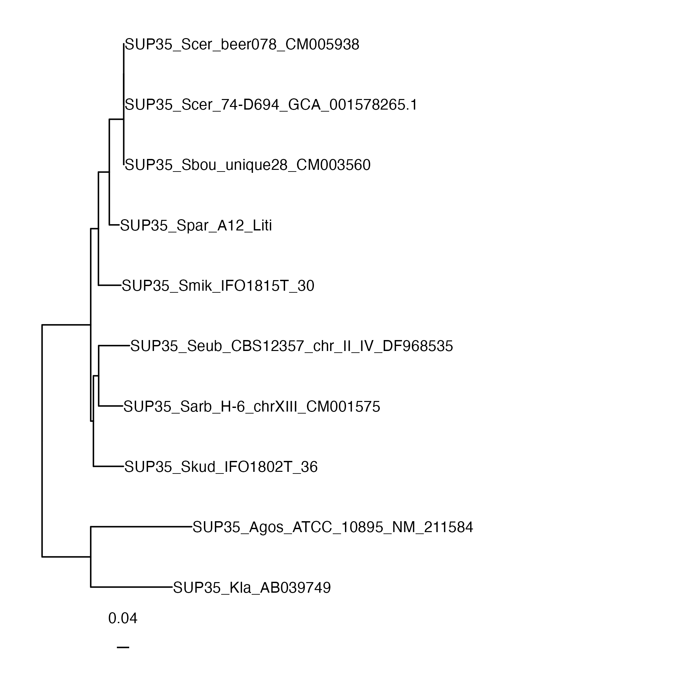
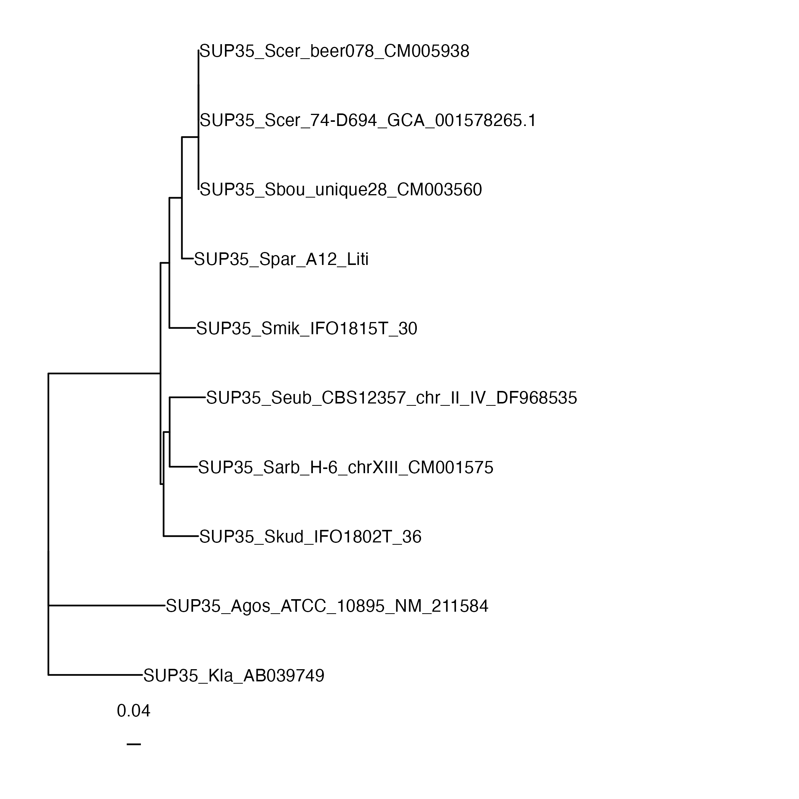
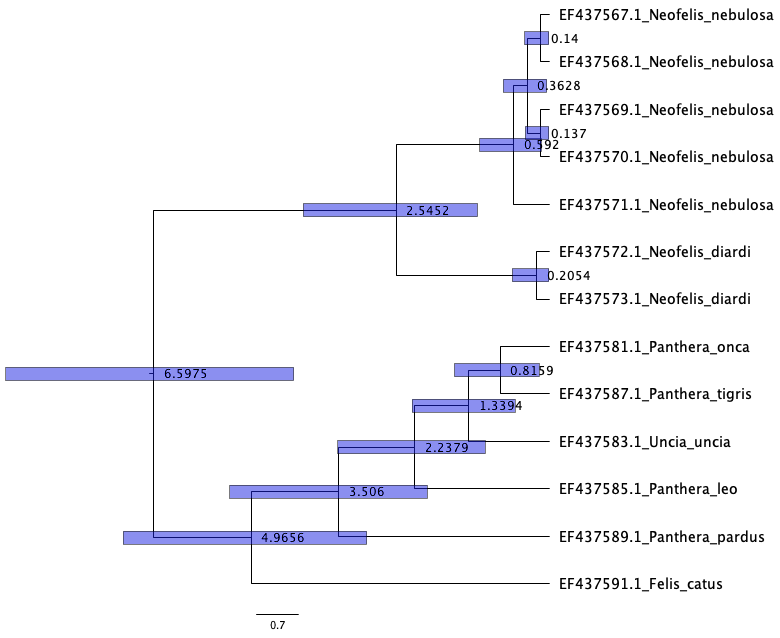

# **Rooting and comparing trees; Dating**

## **Instruction**
<br>


???+ question
    Where to get the data?

Download it from GitHub repository:

```bash
wget https://github.com/ilypopv/NGS-Handbook/raw/refs/heads/main/data/04_Phylogenetics/04_05_Root_Date.zip
```

```bash
unzip 04_05_Root_Date.zip && rm -rf 04_05_Root_Date.zip
```

These are the data and scripts we will be working with:

```
Archive:  04_05_Root_Date.zip
   creating: scripts/
  inflating: scripts/draw_tree.R     
  inflating: scripts/draw_tree_max.R  
   creating: data/
  inflating: data/SUP35_aln_prank.trim.fas
```

>For this work, we will use a filtered alignment (this is the same one we got in the [Trees step](https://github.com/ilypopv/NGS-Handbook/tree/main/04_Phylogenetics/04_04_Trees))

----------------------------------------------

## **Part 1: Rooting trees**

### **Step 1: Rooting a tree by a known external clade in `IQ-TREE`**

Our goal in this part of the manual is to compare different rooting methods.<br>
That's why we shall start by making different trees.<br>
First, let's make a 1000 ufb tree.<br>

**_Input_**

```bash
iqtree2 -s data/SUP35_aln_prank.trim.fas -m TIM3+F+G4 -pre data/iqtree_ufb/SUP35_TIM3_ufb -bb 1000
```

Then let's make a `-bb 1000 -alrt 1000 -abayes` tree.<br>

**_Input_**

```bash
iqtree2 -s data/SUP35_aln_prank.trim.fas -m TIM3+F+G4 -pre data/iqtree_ufb_alrt_abayes/SUP35_TIM3_ufb_alrt_abayes -bb 1000 -alrt 1000 -abayes
```

Finally, let's make a tree rooted by the outgroup!<br>

**_Input_**

```bash
iqtree2 -s data/SUP35_aln_prank.trim.fas -m TIM3+F+G4 -pre data/iqtree_root_outgroup/SUP35_TIM3_root_outgroup -bb 1000 -alrt 1000 -abayes  -o SUP35_Kla_AB039749,SUP35_Agos_ATCC_10895_NM_211584
```

----------------------------------------------

### **Step 2: Rooting a tree using `midpoint rooting`**

There are two ways to root the tree at the midpoint: by using Python or R.<br>
Below we will use prewritten scripts.<br>
Let's take a look at them:

=== "Python"

    ``` py title="midpoint_root.py"
    import sys
    from ete3 import Tree
    intre = sys.argv[1]
    tre = Tree(intre, quoted_node_names=True)
    midpoint = tre.get_midpoint_outgroup()
    tre.set_outgroup(midpoint)
    print(tre.write())
    ```

=== "R"

    ``` R title="midpoint_root.R"
    #install.packages("phytools")
    library(phytools)
    tree_alrt_abayes_ufb <- read.tree("iqtree_ufb_alrt_abayes/SUP35_TIM3_ufb_alrt_abayes.treefile")
    midpoint.root(tree_alrt_abayes_ufb)
    write.tree(tree_alrt_abayes_ufb, "iqtree_ufb_alrt_abayes/SUP35_TIM3_ufb_alrt_abayes_rooted.treefile")
    ```

**_Input_**

=== "Python script"

    ```bash
    python3 scripts/midpoint_root.py data/iqtree_ufb/SUP35_TIM3_ufb.treefile >data/iqtree_ufb/SUP35_TIM3_ufb_midpoint.treefile
    ```

=== "R script"

    ```bash
    Rscript scripts/midpoint_root.R
    ```

#### **Step 2.1: Visualisation of the rooted trees**

For drawing trees we will use a simple prewritten R script. Let's take a look at it to understand how it works:

``` R title="draw_tree.R"
#!/usr/bin/env Rscript
args <- commandArgs(trailingOnly=TRUE)

library(ggtree)
tr <- read.tree(args[1]) ##SUP35_raxml.raxml.bestTree
ggtree(tr) + geom_tiplab() + xlim(0,2) + 
  geom_treescale()

ggsave(args[2])
```

**_Input_**

```bash
Rscript scripts/draw_tree.R data/iqtree_ufb/SUP35_TIM3_ufb.treefile ../imgs/SUP35_TIM3_ufb.png
Rscript scripts/draw_tree.R data/iqtree_ufb/SUP35_TIM3_ufb_midpoint.treefile ../imgs/SUP35_TIM3_ufb_midpoint.png
Rscript scripts/draw_tree.R data/iqtree_root_outgroup/SUP35_TIM3_root_outgroup.treefile ../imgs/SUP35_TIM3_root_outgroup.png
Rscript scripts/draw_tree.R data/iqtree_ufb_alrt_abayes/SUP35_TIM3_ufb_alrt_abayes_rooted.treefile ../imgs/SUP35_TIM3_ufb_alrt_abayes_rooted.png
```

**_Output_**

|SUP35_TIM3_ufb.png|SUP35_TIM3_ufb_midpoint.png|SUP35_TIM3_root_outgroup.png|SUP35_TIM3_ufb_alrt_abayes_rooted.png|
|------------------|---------------------------|----------------------------|-------------------------------------|
|||||

- Unrooted and rooted by external group are completely identical. 0 differences.<br>
- Rooted by `midpoint` looks neater. Topology looks better.<br>

----------------------------------------------

### **Step 3: Rooting a tree using an irreversible (`non-reversible`) model (`iq-tree2`)**

If we have a rather complex tree structure (it is huge, there are long branches, imbalance in sampling by different taxa), rooting the tree by external group will not give us the result we expect.<br>
There are more intelligent models for this.<br>
One of them is the easy-to-apply `non-reversible` model `iq-tree2`.<br>
The idea is that they allow you to predict where the root was! This, by analogy with `bootstrap` is called `rootstrap`.

**_Input_**

```bash
iqtree2 -s data/SUP35_aln_prank.trim.fas -m TIM3+F+G4 -pre data/iqtree_root_auto/SUP35_TIM3_root_auto --model-joint 12.12 -B 1000
# -B 1000 -  it's not `bootstrap`, it's how many times to run `rootstrap`
```

**_Input_**

```bash
cat data/iqtree_root_auto/SUP35_TIM3_root_auto.rootstrap.nex
# - contains information about the algorithm's confidence in where the root is located
```

**_Output_**

```
#NEXUS
[ This file is best viewed in FigTree. ]
begin trees;
  tree tree_1 = ((SUP35_Kla_AB039749:0.2581582648[&id="2",rootstrap="26.8"],SUP35_Agos_ATCC_10895_NM_211584:0.3420323394[&id="3",rootstrap="5.4"]):0.1209998432[&id="1",rootstrap="42.4"],(((((((SUP35_Scer_74-D694_GCA_001578265.1:0.0004800339[&id="11",rootstrap="0"],SUP35_Scer_beer078_CM005938:0.0000010000[&id="12",rootstrap="0"]):0.0000010000[&id="10",rootstrap="0"],SUP35_Sbou_unique28_CM003560:0.0004800702[&id="13",rootstrap="0"]):0.0463459057[&id="9",rootstrap="0"],SUP35_Spar_A12_Liti:0.0325384431[&id="14",rootstrap="0.1"]):0.0354767121[&id="8",rootstrap="0.2"],SUP35_Smik_IFO1815T_30:0.0736998639[&id="15",rootstrap="0.6"]):0.0322607827[&id="7",rootstrap="0.5"],SUP35_Skud_IFO1802T_36:0.0970836557[&id="16",rootstrap="0.7"]):0.0154599513[&id="6",rootstrap="1.8"],SUP35_Sarb_H-6_chrXIII_CM001575:0.0787155739[&id="17",rootstrap="4.8"]):0.0099429593[&id="5",rootstrap="8.6"],SUP35_Seub_CBS12357_chr_II_IV_DF968535:0.0912344001[&id="18",rootstrap="5.1"]):0.1942253516[&id="4",rootstrap="42.4"]):0.0000010000[&id="0",rootstrap="42.4"];
end;
```

This is basically a `Newick` file, but strange `Newick`  because it has square brackets in it.<br>
Programs that read `Newick` format will not be able to read this tree. According to the developers of `iqtree` it is better to read this tree in `FigTree`.<br>

----------------------------------------------

### **Step 4: Root-supported tree visualisation (`rootstrap`)**
???+ question
    What can we say about the algorithm's confidence in root selection?

**_Input_**

```bash
figtree data/iqtree_root_auto/SUP35_TIM3_root_auto.rootstrap.nex
```

**_Output_**

<div style='justify-content: center'>

</div>

???+ success
    It can't say anything specific about where the tree splits. There's a 42.4% chance the root is either in one place or the other.<br>

----------------------------------------------

## **Part 2: Dating**

???+ abstract
    Analyze the age of the common ancestor of the two species of smoky leopards from the article https://doi.org/10.1016/j.cub.2006.08.066 based on sequencing data of the `atp8` gene region, relying on known data on the frequency of substitutions in mtDNA (approximately 2% per million years) in `beauti` and `beast`<br>

    - Check the quality in `Tracer`<br>
    - Combine trees in `treeannotator`.<br>
    - Draw the final tree.<br>
    - Be sure to show estimates of the age of the common ancestor at the nodes!<br>

**_Input_**

```bash
efetch -db popset -id 126256179 -format fasta >data/atp8/felidae_atp8.fa
```

**_Input_**

```bash
cut -d ' ' -f 1,2,3 data/atp8/felidae_atp8.fa | sed -e 's/ /_/g' > data/atp8/felidae_atp8.renamed.fa
```

**_Input_**

```bash
mafft --auto data/atp8/felidae_atp8.renamed.fa >data/atp8/felidae_atp8.aln
```

**_Input_**

```bash
trimal -in data/atp8/felidae_atp8.aln -out data/atp8/felidae_atp8.trim.fas -nogaps
```

**_Input_**

```bash
iqtree2 -s data/atp8/felidae_atp8.trim.fas -o EF437591.1_Felis_catus -alrt 1000 -abayes
```

**_Input_**

```python
from Bio import Phylo
```

**_Input_**

```python
tree = Phylo.read("data/atp8/felidae_atp8.trim.fas.treefile", "newick")
```

**_Input_**

```python
Phylo.draw_ascii(tree)
```

**_Output_**

```
                                          , EF437567.1_Neofelis_nebulosa
                                          |
                                          | EF437569.1_Neofelis_nebulosa
                                          |
                                          | EF437570.1_Neofelis_nebulosa
                                          |
                                   _______| EF437568.1_Neofelis_nebulosa
                                  |       |
  ________________________________|       |_ EF437571.1_Neofelis_nebulosa
 |                                |
 |                                |            , EF437572.1_Neofelis_diardi
 |                                |____________|
 |                                             | EF437573.1_Neofelis_diardi
 |
 |                             __ EF437581.1_Panthera_onca
 |                           ,|
_|                      _____||____ EF437587.1_Panthera_tigris
 |                     |     |
 |            _________|     |_______ EF437583.1_Uncia_uncia
 |           |         |
 |___________|         |________ EF437585.1_Panthera_leo
 |           |
 |           |______________ EF437589.1_Panthera_pardus
 |
 |______________ EF437591.1_Felis_catus
```

The outside group is the house cat. Because everyone else is a big cat.<br>
Fundamentally our tree is similar to that published in articles.<br>
In foreign colleagues the tree was based on several genes, we take only 1 piece of data.<br>

**Beauti**

`Beauti` is the GUI application. So I will just provide as many screenshots as possible.

<div style='justify-content: center'>

</div>

When loading the file, we select that we have nucleotide sequences

<div style='justify-content: center'>

</div>

Everything is okay.

<div style='justify-content: center'>

</div>

In `Site model` select TN93 and empirical frequencies

<div style='justify-content: center'>

</div>

In `Clock model` we choose 0.02. Why? Because we rely on the known data on the frequency of substitutions in mtDNA (approximately 2% per million years)

<div style='justify-content: center'>

</div>

Everything is okay.

<div style='justify-content: center'>

</div>

Save everything to `felidae_2percent.xml`.

**_Input_**

```bash
beast data/atp8/felidae_2percent.xml
```

**Tracer**

`Tracer` is the GUI application. So I will just provide as many screenshots as possible.

<div style='justify-content: center'>

</div>

All `ESS` scores are in perfect order.

<div style='justify-content: center'>

</div>

The so-called "hairy caterpillar".

**TreeAnnotator**

`TreeAnnotator` is the GUI application. So I will just provide as many screenshots as possible.

<div style='justify-content: center'>

</div>

Set parameters, and set `input` and `output`. Useful hint - output can be named the same way, but not .trees, just .tree!

**FigTree**

`FigTree` is the GUI application. So I will just provide as many screenshots as possible.

<div style='justify-content: center'>

</div>

<div style='justify-content: center'>

</div>

Fiddled with the parameters and got these results.

???+ success
    Well. The common ancestor of our smoky leopards is about 2.5 million years old.

----------------------------------------------

???+ question
    Compare the results of this analysis (age of the last common ancestor of _Neofelis_) with published articles (https://www.science.org/doi/10.1126/sciadv.adh9143, https://www.sciencedirect.com/science/article/pii/S2589004222019198).<br>
    What conclusions can be drawn?

???+ success
    In the first article - https://www.science.org/doi/10.1126/sciadv.adh9143 there was a full genome analysis. Their estimate of the age of the common ancestor of smoky leopards is 2.2 million years.<br>
    And we hit 100 nucleotides pretty good!<br>

    But in the second article - https://www.sciencedirect.com/science/article/pii/S2589004222019198 - the age of the ancestor is 5.1 million years old.... Well. Interesting. Can't explain it yet.<br>
