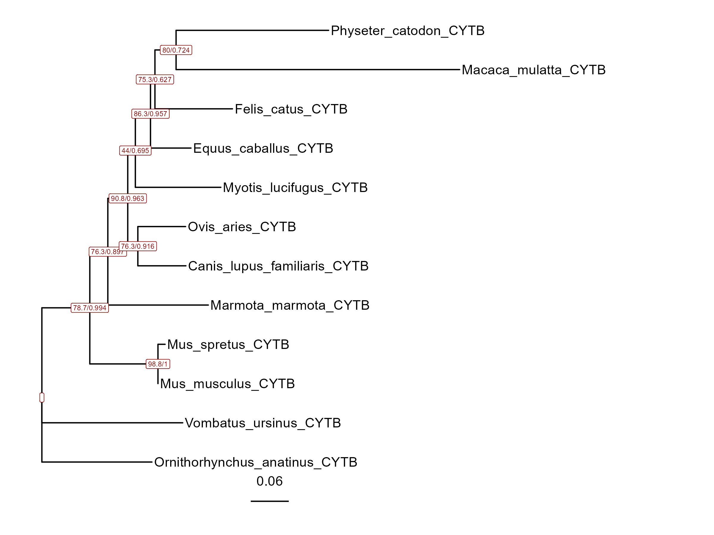
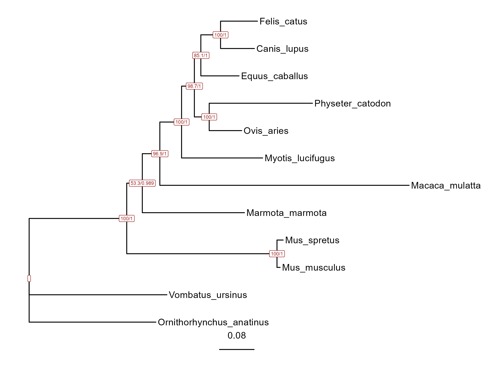
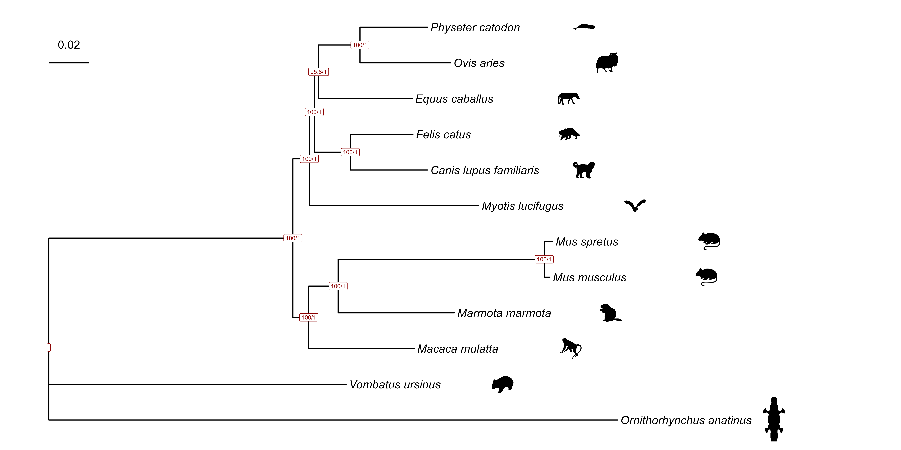
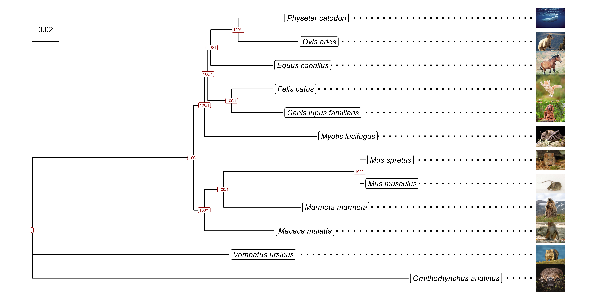

# **Phylogenomics**

## **Instruction**
<br>


???+ question
    In this chapter we will use a lot of prewritten scripts and even some images for visualization. Where to get them?

Download it from GitHub repository:

```bash
wget https://github.com/ilypopv/NGS-Handbook/raw/refs/heads/main/data/04_Phylogenetics/04_06_Phylogenomics.zip
```

```bash
unzip 04_06_Phylogenomics.zip && rm -rf 04_06_Phylogenomics.zip
```

These are the scripts and images we will be working with:

```
Archive:  04_06_Phylogenomics.zip
   creating: photos/
  inflating: photos/Canis lupus familiaris.jpeg  
  inflating: photos/Equus caballus.jpeg  
  inflating: photos/Felis catus.jpeg  
  inflating: photos/Macaca mulatta.jpeg  
  inflating: photos/Marmota marmota.jpeg  
  inflating: photos/Mus musculus.jpeg  
  inflating: photos/Mus spretus.jpeg  
  inflating: photos/Myotis lucifugus.jpeg  
  inflating: photos/Ornithorhynchus anatinus.jpeg  
  inflating: photos/Ovis aries.jpeg  
  inflating: photos/Physeter catodon.jpeg  
  inflating: photos/Vombatus ursinus.jpeg  
   creating: scripts/
  inflating: scripts/draw_tree.R     
  inflating: scripts/draw_tree_icons.R  
  inflating: scripts/draw_tree_photos.R  
  inflating: scripts/one_gene_tree.sh  
  inflating: scripts/write_family_names.R
```

## **Introduction**

This guide is about reconstructing phylogeny using more than just one gene.<br>

During this work there are several trees constructed. Some are good, some are bad. If you are interested in comparing the phylogenies - see [04_08_Tanglegram](https://ilypopv.github.io/NGS-Handbook/IV.%20Phylogenetics/04_08_Tanglegram/)

## **Part 1. Phylogeny of selected mammalian species based on mitochondrial genomes.**

???+ abstract
    **Objective**: construct a phylogeny for 13 mitochondrial protein-coding genes using a supermatrix of concatenated genes

### **Step 1: Preparation**

First we create the directories to store the data<br>
There will be 2 parts of `Phylogenomics` manual, that's why we will store mitochondrion data to the `part_1` directory

**_Input_**

```bash
mkdir data/
mkdir data/part_1/
```

Now create `mitochondrions` directory to store exactly the data we will be working with

**_Input_**

```bash
mkdir data/part_1/mitochondrions/
```

----------------------------------------------------------------------

### **Step 2: Downloading the data**

Download mitochondrial protein-coding genes of *Physeter catodon*

**_Input_**

```bash
esearch -db nuccore -query NC_002503 | efetch -format fasta_cds_aa > \
  data/part_1/mitochondrions/Physeter_catodon_mt_prot.fa 
```

Download mitochondrial protein-coding genes of *Ovis aries*

**_Input_**

```bash
esearch -db nuccore -query NC_001941 | efetch -format fasta_cds_aa > \
  data/part_1/mitochondrions/Ovis_aries_mt_prot.fa 
```

Download mitochondrial protein-coding genes of *Equus caballus*

**_Input_**

```bash
esearch -db nuccore -query NC_001640 | efetch -format fasta_cds_aa > \
  data/part_1/mitochondrions/Equus_caballus_mt_prot.fa 
```

Download mitochondrial protein-coding genes of *Felis catus*

**_Input_**

```bash
esearch -db nuccore -query NC_001700 | efetch -format fasta_cds_aa > \
  data/part_1/mitochondrions/Felis_catus_mt_prot.fa 
```

Download mitochondrial protein-coding genes of *Canis lupus familiaris*

**_Input_**

```bash
esearch -db nuccore -query NC_002008 | efetch -format fasta_cds_aa > \
  data/part_1/mitochondrions/Canis_lupus_familiaris_mt_prot.fa 
```

Download mitochondrial protein-coding genes of *Myotis lucifugus*

**_Input_**

```bash
esearch -db nuccore -query NC_029849 | efetch -format fasta_cds_aa > \
  data/part_1/mitochondrions/Myotis_lucifugus_mt_prot.fa 
```

Download mitochondrial protein-coding genes of *Mus spretus*

**_Input_**

```bash
esearch -db nuccore -query NC_025952 | efetch -format fasta_cds_aa > \
  data/part_1/mitochondrions/Mus_spretus_mt_prot.fa  
```

Download mitochondrial protein-coding genes of *Mus musculus*

**_Input_**

```bash
esearch -db nuccore -query NC_005089 | efetch -format fasta_cds_aa > \
  data/part_1/mitochondrions/Mus_musculus_mt_prot.fa  
```

Download mitochondrial protein-coding genes of *Marmota marmota*

**_Input_**

```bash
esearch -db nuccore -query MN935776 | efetch -format fasta_cds_aa > \
  data/part_1/mitochondrions/Marmota_marmota_mt_prot.fa
```

Download mitochondrial protein-coding genes of *Macaca mulatta*

**_Input_**

```bash
esearch -db nuccore -query NC_005943 | efetch -format fasta_cds_aa > \
  data/part_1/mitochondrions/Macaca_mulatta_mt_prot.fa
```

Download mitochondrial protein-coding genes of *Ornithorhynchus anatinus*

**_Input_**

```bash
esearch -db nuccore -query NC_000891 | efetch -format fasta_cds_aa > \
  data/part_1/mitochondrions/Ornithorhynchus_anatinus_mt_prot.fa
```

Download mitochondrial protein-coding genes of *Vombatus ursinus*

**_Input_**

```bash
esearch -db nuccore -query NC_003322 | efetch -format fasta_cds_aa > data/part_1/mitochondrions/Vombatus_ursinus_mt_prot.fa
```

Now let's check the `data/part_1/mitochondrions/` directory!

**_Input_**

```bash
ls data/part_1/mitochondrions/
```

**_Output_**

```
Canis_lupus_familiaris_mt_prot.fa  Mus_spretus_mt_prot.fa
Equus_caballus_mt_prot.fa	   Myotis_lucifugus_mt_prot.fa
Felis_catus_mt_prot.fa		   Ornithorhynchus_anatinus_mt_prot.fa
Macaca_mulatta_mt_prot.fa	   Ovis_aries_mt_prot.fa
Marmota_marmota_mt_prot.fa	   Physeter_catodon_mt_prot.fa
Mus_musculus_mt_prot.fa		   Vombatus_ursinus_mt_prot.fa
```

All right! We have all the data we need to work with, but...<br>
Let's take a look at how the sequences are named in these files.<br>

**_Input_**

```bash
head -1 data/part_1/mitochondrions/Canis_lupus_familiaris_mt_prot.fa
```

**_Output_**

```
>lcl|NC_002008.4_prot_NP_008471.1_1 [gene=ND1] [locus_tag=KEF55_p13] [db_xref=GeneID:804476] [protein=NADH dehydrogenase subunit 1] [transl_except=(pos:955..956,aa:TERM)] [protein_id=NP_008471.1] [location=2747..3702] [gbkey=CDS]
```

Total mess!<br>
Yes, there are a lot of information, but any tool will complain that this is too muchWe need to rename the sequences!<br>
For that let's create another directory called `mitochondrions_renamed`

----------------------------------------------------------------------

### **Step 3: 1st seqs renaming**

**_Input_**

```bash
mkdir data/part_1/mitochondrions_renamed/
```

Now let's rename `>lcl|NC_002008.4_prot_NP_008471.1_1 [gene=ND1]...` to just `>ND1` and store renamed files in another directory (`data/part_1/mitochondrions_renamed/`).<br>

**_Input_**

```bash
%%bash

for file in data/part_1/mitochondrions/*mt_prot.fa
do sed -e 's/.*ND1.*/>ND1/' $file | sed -e 's/.*ND2.*/>ND2/' | sed -e 's/.*ND3.*/>ND3/' | sed -e 's/.*ND4].*/>ND4/' | sed -e 's/.*ND4L].*/>ND4L/' | sed -e 's/.*ND5.*/>ND5/' |  sed -e 's/.*ND6.*/>ND6/' | sed -e 's/.*COX1.*/>COX1/' | sed -e 's/.*COX2.*/>COX2/'  | sed -e 's/.*COX3.*/>COX3/' | sed -e 's/.*ATP6.*/>ATP6/'  | sed -e 's/.*ATP8.*/>ATP8/' | sed -e 's/.*CYTB.*/>CYTB/' >data/part_1/mitochondrions_renamed/$(basename "$file" _mt_prot.fa)_renamed_mt_prot.fa
done
```

Let's check `mitochondrions_renamed` directory!<br>

**_Input_**

```bash
ls data/part_1/mitochondrions_renamed/
```

**_Output_**

```
Canis_lupus_familiaris_renamed_mt_prot.fa
Equus_caballus_renamed_mt_prot.fa
Felis_catus_renamed_mt_prot.fa
Macaca_mulatta_renamed_mt_prot.fa
Marmota_marmota_renamed_mt_prot.fa
Mus_musculus_renamed_mt_prot.fa
Mus_spretus_renamed_mt_prot.fa
Myotis_lucifugus_renamed_mt_prot.fa
Ornithorhynchus_anatinus_renamed_mt_prot.fa
Ovis_aries_renamed_mt_prot.fa
Physeter_catodon_renamed_mt_prot.fa
Vombatus_ursinus_renamed_mt_prot.fa
```

Hooray! we have all 12 files with renamed sequences!<br>
Anyway let's check that we did everything fine...<br>

**_Input_**

```bash
head -1 data/part_1/mitochondrions_renamed/Canis_lupus_familiaris_renamed_mt_prot.fa
```

**_Output_**

```
>ND1
```

Yep! That's just it!<br>
But it is still not perfect...<br>
Let's rename `>ND1` to `>species_ND1`<br>
For that we need to install `BBMap`!<br>

----------------------------------------------------------------------

### **Step 4: Install `BBMap`**

Download `.tar.gz` archive.<br>

**_Input_**

```bash
wget https://sourceforge.net/projects/bbmap/files/latest/download -O BBMap.tar.gz
```

Unpack it.<br>

**_Input_**

```bash
tar -xvzf BBMap.tar.gz
```

Delete the initial archive.<br>

**_Input_**

```bash
rm -rf BBMap.tar.gz
```

----------------------------------------------------------------------

### **Step 5: 2nd seqs renaming**

To store our final files let's create the `mitochondrions_renamed_final` directory.<br>

**_Input_**

```bash
mkdir data/part_1/mitochondrions_renamed_final/
```

Now we rename sequences from `>ND1` to `>species_ND1` (it works for every gene).<br>
The `BBMap` tool will take species name from the file name (e.g. `Canis_lupus_familiaris_renamed_mt_prot.fa` = `Canis_lupus_familiaris`).<br>

**_Input_**

```bash
%%bash

for file in data/part_1/mitochondrions_renamed/*mt_prot.fa
do export species_name=$(basename $file _renamed_mt_prot.fa)
bbmap/rename.sh in=$file prefix="$species_name" addprefix=true out=data/part_1/mitochondrions_renamed_final/$species_name.mt_prots.fa ignorejunk=true ;
done
```

Now let's check `data/part_1/mitochondrions_renamed_final/` directory!<br>

**_Input_**

```bash
ls data/part_1/mitochondrions_renamed_final/
```

**_Output_**

```
Canis_lupus_familiaris.mt_prots.fa  Mus_spretus.mt_prots.fa
Equus_caballus.mt_prots.fa	    Myotis_lucifugus.mt_prots.fa
Felis_catus.mt_prots.fa		    Ornithorhynchus_anatinus.mt_prots.fa
Macaca_mulatta.mt_prots.fa	    Ovis_aries.mt_prots.fa
Marmota_marmota.mt_prots.fa	    Physeter_catodon.mt_prots.fa
Mus_musculus.mt_prots.fa	    Vombatus_ursinus.mt_prots.fa
```

Yay! All the 12 files! Finally, let's check the sequences names!<br>

**_Input_**

```bash
head -1 data/part_1/mitochondrions_renamed_final/Canis_lupus_familiaris.mt_prots.fa
```

**_Output_**

```
>Canis_lupus_familiaris_ND1
```

Just perfect! That's what we need!<br>

----------------------------------------------------------------------

### **Step 6: Phylogenomics on the mitochondrial proteins**

For the 1st step let's create the directory where we will store `.txt` files with gene names and call it `gene_names`

**_Input_**

```bash
mkdir data/part_1/gene_names/
```

Now we will reconstruct the phylogeny 2 times:<br>

1.  Only on `CYTB` protein.<br>
2.  On every protein.<br>

#### **CYTB phylogeny**

Extract the `CYTB` gene names from each file we have.<br>
And write it to the `CYTB_names.txt` file.<br>

**_Input_**

```bash
grep CYTB data/part_1/mitochondrions_renamed_final/*mt_prots.fa --no-filename | cut -c2- > data/part_1/gene_names/CYTB_names.txt
```

Now let's chek the `CYTB_names.txt` file.<br>

**_Input_**

```bash
head -10 data/part_1/gene_names/CYTB_names.txt
```

**_Output_**

```
Canis_lupus_familiaris_CYTB
Equus_caballus_CYTB
Felis_catus_CYTB
Macaca_mulatta_CYTB
Marmota_marmota_CYTB
Mus_musculus_CYTB
Mus_spretus_CYTB
Myotis_lucifugus_CYTB
Ornithorhynchus_anatinus_CYTB
Ovis_aries_CYTB
```

Excellent! Now let's extract `CYTB` sequences only!<br>

For that we will create a directory called `mt_genes` and there will be 2 sub-directories:<br>

1. `sep` - there will be stored 12 genes separately for each one of the species we are working with.<br>
2. `merged` - there will be stored a merged `.fasta` file with 12 genes in 1 file.<br>

**_Input_**

```bash
mkdir data/part_1/mt_genes/
mkdir data/part_1/mt_genes/sep/
mkdir data/part_1/mt_genes/merged/
```

Now we extract `CYTB` gene sequences from the species mitochondrions using `BBMap` and previously created `CYTB_names.txt` file.<br>

**_Input_**

```bash
%%bash

for file in data/part_1/mitochondrions_renamed_final/*.mt_prots.fa
do bbmap/filterbyname.sh in=$file out=data/part_1/mt_genes/sep/$(basename "$file" .mt_prots.fa).CYTB.aa.fa include=t names=data/part_1/gene_names/CYTB_names.txt overwrite=true ignorejunk=true
done
```

Merge 12 separate sequences to 1 `.fasta` file with 12 sequences!<br>

**_Input_**

```bash
cat data/part_1/mt_genes/sep/*CYTB.aa.fa > data/part_1/mt_genes/merged/CYTB.aa.fa
```

Now let's align 12 `CYTB` gene sequences!<br>
For that let's create the `mt_aligns` directory.<br>

**_Input_**

```bash
mkdir data/part_1/mt_aligns/
```

Now let's do the alignment with `MAFFT`.<br>

**_Input_**

```bash
mafft --auto data/part_1/mt_genes/merged/CYTB.aa.fa > data/part_1/mt_aligns/CYTB.aa.aln
```

Done!<br>
And the final step - phylogeny reconstruction with `IQ-TREE`!<br>
For that let's create another directory to store tree files.<br>

**_Input_**

```bash
mkdir data/part_1/CYTB_tree/
```

Run the `IQ-TREE`!<br>

**_Input_**

```bash
iqtree2 -s data/part_1/mt_aligns/CYTB.aa.aln --prefix data/part_1/CYTB_tree/CYTB -alrt 1000 -abayes -o Ornithorhynchus_anatinus_CYTB,Vombatus_ursinus_CYTB --redo
```

Now let's make the directory to store all the images.<br>

**_Input_**

```bash
mkdir imgs
```

And finally let's visualize the tree with `ggtree` in `R`!<br>

But first let's take a look at the script we will use for visualization:<br>

``` R title="draw_tree.R"
#!/usr/bin/env Rscript
args <- commandArgs(trailingOnly=TRUE)

library(ggtree)

tr <- read.tree(args[1])

ggtree(tr) + geom_tiplab() + 
  xlim(0,1) + geom_label2(aes(subset=!isTip, label=label), col="red4", size=2, fill="white", label.size=0.2) + 
  geom_treescale()

ggsave(args[2], width = 8, height=6)
```

**_Input_**

```bash
Rscript scripts/draw_tree.R data/part_1/CYTB_tree/CYTB.treefile ../imgs/CYTB_tree.png
```

Let's take a look at it:

<div style='justify-content: center'>

</div>

Well... This is a total mess...<br>
The bat is closer to the cat... The dog is almost a brother to the sheep...<br>
What's wrong? We did the phylogeny using `CYTB` gene only!!! That's the problem. But how do we reconstruct the phylogeny with every mitochondrial gene?<br>
Watch'n'learn...<br>

#### **All mitochondrial genes phylogeny**

We already have all the data we need in `mitochondrions_renamed_final` directory<br>
We just need to repeat all the steps we did with `CYTB` gene but now using every other gene<br>
We can do it manually, but it is BORING!<br>
That's why let's take a look on `one_gene_tree.sh` script:

**_Input_**

```bash
cat scripts/one_gene_tree.sh
```

**_Output_**

``` bash title="one_gene_tree.sh"
grep $gene$ data/part_1/mitochondrions_renamed_final/*mt_prots.fa --no-filename | cut -c2- > data/part_1/gene_names/$(basename "$gene")_names.txt
for file in data/part_1/mitochondrions_renamed_final/*.mt_prots.fa; do bbmap/filterbyname.sh in=$file out=data/part_1/mt_genes/sep/$(basename "$file" .mt_prots.fa).$gene.aa.fa include=t names=data/part_1/gene_names/$gene_names.txt overwrite=true ignorejunk=true; done
cat data/part_1/mt_genes/sep/*$gene.aa.fa > data/part_1/mt_genes/merged/$gene.aa.fa
mafft --auto data/part_1/mt_genes/merged/$gene.aa.fa > data/part_1/mt_aligns/$gene.aa.aln
```

It looks just perfect! It does all the steps from creating `$gene$_names.txt` file to aligning the seqs with `MAFFT`.<br>
Now let's launch this script with 12 other genes!<br>

**COX1 gene**

**_Input_**

```bash
export gene=COX1; scripts/one_gene_tree.sh
```

**ND2 gene**

**_Input_**

```bash
export gene=ND2; scripts/one_gene_tree.sh
```

**ND3 gene**

**_Input_**

```bash
export gene=ND3; scripts/one_gene_tree.sh
```

**ND4 gene**

**_Input_**

```bash
export gene=ND4; scripts/one_gene_tree.sh
```

**ND4L gene**

**_Input_**

```bash
export gene=ND4L; scripts/one_gene_tree.sh
```

**ND5 gene**

**_Input_**

```bash
export gene=ND5; scripts/one_gene_tree.sh
```

**ND6 gene**

**_Input_**

```bash
export gene=ND6; scripts/one_gene_tree.sh
```

**COX2 gene**

**_Input_**

```bash
export gene=COX2; scripts/one_gene_tree.sh
```

**COX3 gene**

**_Input_**

```bash
export gene=COX3; scripts/one_gene_tree.sh
```

**ATP6 gene**

**_Input_**

```bash
export gene=ATP6; scripts/one_gene_tree.sh
```

**ATP8 gene**

**_Input_**

```bash
export gene=ATP8; scripts/one_gene_tree.sh
```

**ND1 gene**

**_Input_**

```bash
export gene=ND1; scripts/one_gene_tree.sh
```

Perfect! Now let's check how did the script work. let's check the `mt_aligns` directory.<br>

**_Input_**

```bash
ls data/part_1/mt_aligns/
```

**_Output_**

```
ATP6.aa.aln  COX2.aa.aln  ND1.aa.aln  ND4.aa.aln   ND6.aa.aln
ATP8.aa.aln  COX3.aa.aln  ND2.aa.aln  ND4L.aa.aln
COX1.aa.aln  CYTB.aa.aln  ND3.aa.aln  ND5.aa.aln
```

Yay! There are 13 alignments.<br>
But we cannot lauch `IQ-TREE` right now...<br>
Because:<br>

**_Input_**

```bash
head -1 data/part_1/mt_aligns/ATP6.aa.aln
```

**_Output_**

```
>Canis_lupus_familiaris_ATP6
```

**_Input_**

```bash
head -1 data/part_1/mt_aligns/ND6.aa.aln
```

**_Output_**

```
>Canis_lupus_familiaris_ND6
```

Because organisms names are not uniform.<br>
In `ATP6.aa.aln` file *Canis lupus familiaris* is called `Canis_lupus_familiaris_ATP6` and in `ND6.aa.aln` file it is called `Canis_lupus_familiaris_ND6`.<br>
We need to make it `Canis_lupus` everywhere!<br>

For that let's make a directory where we will store renamed alignments.<br>

**_Input_**

```bash
mkdir data/part_1/mt_aligns_renamed/
```

And now let's just rename them!<br>

**_Input_**

```bash
for file in data/part_1/mt_aligns/*aln; do cut -d_ -f1,2 $file > data/part_1/mt_aligns_renamed/$(basename "$file" .aa.aln)_renamed.aa.aln; done
```

**_Input_**

```bash
head -1 data/part_1/mt_aligns_renamed/ATP6_renamed.aa.aln
```

**_Output_**

```
>Canis_lupus
```

**_Input_**

```bash
head -1 data/part_1/mt_aligns_renamed/ND6_renamed.aa.aln
```

**_Output_**

```
>Canis_lupus
```

That's itIt is a perfect input to `IQ-TREE`!<br>
So we are ready to run it.<br>
But first let's make a directory for that tree.<br>

**_Input_**

```bash
mkdir data/part_1/mt_tree/
```

Run the `IQ-TREE`!

**_Input_**

```bash
iqtree2 -s data/part_1/mt_aligns_renamed --prefix data/part_1/mt_tree/mt_tree -alrt 1000 -abayes -o Ornithorhynchus_anatinus,Vombatus_ursinus --redo
```

And finally let's visualize the tree with `ggtree` in `R`!<br>

**_Input_**

```bash
Rscript scripts/draw_tree.R data/part_1/mt_tree/mt_tree.treefile ../imgs/mt_proteins_alns_tree.png
```

Let's take a look at it:

<div style='justify-content: center'>

</div>

It is sooo much better now!!! *Canis lupus* and *Felis catus* are on the same clade!<br>
But still there are some strange moments... What is wrong with *Macaca mulata*...? It can be explained by the fact that we were working with mitochondrial genes. It is not the perfect material to work with. In the 2nd part of this manual we will work with proteomes!<br>

----------------------------------------------

## **Part 2. Phylogeny of selected mammalian species based on proteomes.**

???+ abstract
    **Objective**: construct a phylogeny for 13 proteomes

### **Step 1: Preparation**

First we create the directories to store the data.<br>
It is the 2nd part of `Phylogenomics` manual, that's why we will store proteomes data to the `part_2` directory.<br>

**_Input_**

```bash
mkdir data/part_2/
```

Now create `proteomes` directory to store exactly the data we will be working with.<br>

**_Input_**

```bash
mkdir data/part_2/proteomes/
```

----------------------------------------------

### **Step 2: Downloading the data**

Download *Physeter catodon* proteome

**_Input_**

```bash
wget https://ftp.ensembl.org/pub/release-110/fasta/physeter_catodon/pep/Physeter_catodon.ASM283717v2.pep.all.fa.gz -P data/part_2/proteomes/
```

Download *Ovis aries* proteome

**_Input_**

```bash
wget https://ftp.ensembl.org/pub/release-110/fasta/ovis_aries_rambouillet/pep/Ovis_aries_rambouillet.Oar_rambouillet_v1.0.pep.all.fa.gz -P data/part_2/proteomes/
```

Download *Equus caballus* proteome

**_Input_**

```bash
wget https://ftp.ensembl.org/pub/release-110/fasta/equus_caballus/pep/Equus_caballus.EquCab3.0.pep.all.fa.gz -P data/part_2/proteomes/
```

Download *Felis catus* proteome

**_Input_**

```bash
wget https://ftp.ensembl.org/pub/release-110/fasta/felis_catus/pep/Felis_catus.Felis_catus_9.0.pep.all.fa.gz -P data/part_2/proteomes/
```

Download *Canis lupus familiaris* proteome

**_Input_**

```bash
wget https://ftp.ensembl.org/pub/release-110/fasta/canis_lupus_familiaris/pep/Canis_lupus_familiaris.ROS_Cfam_1.0.pep.all.fa.gz -P data/part_2/proteomes/
```

Download *Myotis lucifugus* proteome

**_Input_**

```bash
wget https://ftp.ensembl.org/pub/release-110/fasta/myotis_lucifugus/pep/Myotis_lucifugus.Myoluc2.0.pep.all.fa.gz -P data/part_2/proteomes/
```

Download *Mus spretus* proteome

**_Input_**

```bash
wget https://ftp.ensembl.org/pub/release-110/fasta/mus_spretus/pep/Mus_spretus.SPRET_EiJ_v1.pep.all.fa.gz -P data/part_2/proteomes/
```

Download *Mus musculus* proteome

**_Input_**

```bash
wget https://ftp.ensembl.org/pub/release-110/fasta/mus_musculus/pep/Mus_musculus.GRCm39.pep.all.fa.gz -P data/part_2/proteomes/
```

Download *Marmota marmota* proteome

**_Input_**

```bash
wget https://ftp.ensembl.org/pub/release-110/fasta/marmota_marmota_marmota/pep/Marmota_marmota_marmota.marMar2.1.pep.all.fa.gz -P data/part_2/proteomes/
```

Download *Macaca mulatta* proteome

**_Input_**

```bash
wget https://ftp.ensembl.org/pub/release-110/fasta/macaca_mulatta/pep/Macaca_mulatta.Mmul_10.pep.all.fa.gz -P data/part_2/proteomes/
```

Download *Ornithorhynchus anatinus* proteome

**_Input_**

```bash
wget https://ftp.ensembl.org/pub/release-110/fasta/ornithorhynchus_anatinus/pep/Ornithorhynchus_anatinus.mOrnAna1.p.v1.pep.all.fa.gz -P data/part_2/proteomes/
```

Download *Vombatus ursinus* proteome

**_Input_**

```bash
wget https://ftp.ensembl.org/pub/release-110/fasta/vombatus_ursinus/pep/Vombatus_ursinus.bare-nosed_wombat_genome_assembly.pep.all.fa.gz -P data/part_2/proteomes/
```

Now let's unzip the downloaded data.<br>

**_Input_**

```bash
gunzip data/part_2/proteomes/*fa.gz
```

Now let's check the `data/part_2/proteomes/` directory!<br>

**_Input_**

```bash
ls data/part_2/proteomes/
```

**_Output_**

```
Canis_lupus_familiaris.ROS_Cfam_1.0.pep.all.fa
Equus_caballus.EquCab3.0.pep.all.fa
Felis_catus.Felis_catus_9.0.pep.all.fa
Macaca_mulatta.Mmul_10.pep.all.fa
Marmota_marmota_marmota.marMar2.1.pep.all.fa
Mus_musculus.GRCm39.pep.all.fa
Mus_spretus.SPRET_EiJ_v1.pep.all.fa
Myotis_lucifugus.Myoluc2.0.pep.all.fa
Ornithorhynchus_anatinus.mOrnAna1.p.v1.pep.all.fa
Ovis_aries_rambouillet.Oar_rambouillet_v1.0.pep.all.fa
Physeter_catodon.ASM283717v2.pep.all.fa
Vombatus_ursinus.bare-nosed_wombat_genome_assembly.pep.all.fa
```

All rightWe have all the data we need to work with, but...<br>
Let's take a look at how the sequences are named in these files.<br>

**_Input_**

```bash
head -1 data/part_2/proteomes/Canis_lupus_familiaris.ROS_Cfam_1.0.pep.all.fa
```

**_Output_**

```
>ENSCAFP00845002002.1 pep primary_assembly:ROS_Cfam_1.0:8:2544435:2544737:1 gene:ENSCAFG00845001473.1 transcript:ENSCAFT00845002518.1 gene_biotype:TR_V_gene transcript_biotype:TR_V_gene
```

Total mess!<br>
Yes, there are a lot of information, but any tool will complain that this is too muchWe need to rename the sequences!<br>
For that let's create another directory called `proteomes_renamed`.<br>

----------------------------------------------

### **Step 3: 1st seqs renaming**

**_Input_**

```bash
mkdir data/part_2/proteomes_renamed/
```

Now let's rename `>ENSCAFP00845002002.1 pep primary_assembly...` to just `>ENSCAFP00845002002.1` and store renamed files in another directory (`data/part_2/proteomes_renamed/`).<br>

???+ note
    What is `ENSCAFP00845002002.1`? It is *Canis lupus familiaris*. Do not ask questions. It is.

**_Input_**

```bash
for file in data/part_2/proteomes/*fa; do sed -e's/\ .*//' $file > data/part_2/proteomes_renamed/$(basename "$file" .pep.all.fa)_renamed.pep.all.fa; done
```

Let's check `proteomes_renamed` directory!<br>

**_Input_**

```bash
ls data/part_2/proteomes_renamed/
```

**_Output_**

```
Canis_lupus_familiaris.ROS_Cfam_1.0_renamed.pep.all.fa
Equus_caballus.EquCab3.0_renamed.pep.all.fa
Felis_catus.Felis_catus_9.0_renamed.pep.all.fa
Macaca_mulatta.Mmul_10_renamed.pep.all.fa
Marmota_marmota_marmota.marMar2.1_renamed.pep.all.fa
Mus_musculus.GRCm39_renamed.pep.all.fa
Mus_spretus.SPRET_EiJ_v1_renamed.pep.all.fa
Myotis_lucifugus.Myoluc2.0_renamed.pep.all.fa
Ornithorhynchus_anatinus.mOrnAna1.p.v1_renamed.pep.all.fa
Ovis_aries_rambouillet.Oar_rambouillet_v1.0_renamed.pep.all.fa
Physeter_catodon.ASM283717v2_renamed.pep.all.fa
Vombatus_ursinus.bare-nosed_wombat_genome_assembly_renamed.pep.all.fa
```

Hooraywe have all 12 files with renamed sequences!<br>
Anyway let's check that we did everything fine...<br>

**_Input_**

```bash
head -1 data/part_2/proteomes_renamed/Canis_lupus_familiaris.ROS_Cfam_1.0_renamed.pep.all.fa
```

**_Output_**

```
>ENSCAFP00845002002.1
```

Yep! That's just it!<br>
But it is still not perfect...<br>
In proteomes from `ensembl` there are some `*` symbols.<br>
Further we will use `proteinortho`and it will crash with error if it sees `*`.<br>
That's why let's remove `*`s!<br>

----------------------------------------------------------------------

### **Step 4: 2nd seqs renaming**

To store our final files let's create the `proteomes_renamed_final` directory.<br>

**_Input_**

```bash
mkdir data/part_2/proteomes_renamed_final/
```

Now we remove ALL the `*`s from every single file.<br>

**_Input_**

```bash
for file in data/part_2/proteomes_renamed/*fa; do cat $file | sed -e's/\*//g' > data/part_2/proteomes_renamed_final/$(basename "$file" _renamed.pep.all.fa)_final.pep.all.fa; done
```

----------------------------------------------------------------------

### **Step 5: `Proteinortho`: Finding orthologs**

???+ warning
    **Note**: if you want to use ANY tool to work with orthologs I strongly recommend to use `DIAMOND` v2.0.9.<br>
    **Reason**: https://github.com/davidemms/OrthoFinder/issues/603

Launch `Proteinortho`.<br>

**_Input_**

```bash
proteinortho data/part_2/proteomes_renamed_final/*.fa -cpus=24
```

Unfortunatelly, `Proteinortho` does not let you to redirect output to any directory you want...<br>
That's why let's move the files ourselves!<br>
For that first let's create a directory - `protein_ortho_output`.<br>

**_Input_**

```bash
mkdir data/part_2/protein_ortho_output/
```

Then let's just move any `myproject*` file to `protein_ortho_output` directory.<br>

**_Input_**

```bash
mv myproject* data/part_2/protein_ortho_output/
```

So, `myproject.proteinortho.tsv` file there are a lot of entries on any ortholog. But how many Single-Copy Orthologs are there?<br>

**_Input_**

```bash
grep -v  \* data/part_2/protein_ortho_output/myproject.proteinortho.tsv  | grep -v -c "," 
```

**_Output_**

```
625
```

Okay. That's good. Now, let's filter that `.tsv` file to store only them (Single-Copy Orthologs).<br>

**_Input_**

```bash
grep -v  \* data/part_2/protein_ortho_output/myproject.proteinortho.tsv  | grep -v "," > data/part_2/protein_ortho_output/myproject.proteinortho.filt.tsv
```

Okay. Okay. Okay. We have a `.tsv` file with info on Single-Copy Orthologs. How do we extract their sequences?<br>

----------------------------------------------------------------------

### **Step 6: Getting orthologs names**

Meet the `write_family_names.R` script!

**_Input_**

```bash
cat scripts/write_family_names.R
```

**_Output_**

``` R title="write_family_names.R"
#!/usr/bin/env Rscript
args <- commandArgs(trailingOnly=TRUE)

# Read the proteinortho table
onetoone <- read.delim(args[1])

  # Create directory to store SCOs
  dir.create(args[2]) #e.g. data/SCOs

  # Write name lists to later extract
   for (i in 4:ncol(onetoone)) {
   writeLines(onetoone[,i], paste0(args[2], names(onetoone[i]), ".names.txt"))
   }
   dir.create(args[3])  
   # And gene lists grouped by families
   for (i in 1:nrow(onetoone)) {
   oo <- as.matrix(onetoone)
   writeLines(oo[i, 4:ncol(onetoone)], paste0(args[3], "family", as.character(i), ".names.txt"))
   }
```

So, this script needs 3 inputs:<br>

1. `.tsv` file with info on Single-Copy Orthologs (SCOs).<br>
2. Path to directory where to store names of the SCOs in `.txt` format.<br>
3. Path to directory where to store names of all the protein families in `.txt` format.<br>

Run the script!<br>

**_Input_**

```bash
Rscript scripts/write_family_names.R data/part_2/protein_ortho_output/myproject.proteinortho.filt.tsv data/part_2/SCOs/ data/part_2/families_tree/
```

Now let's take a look on some of the outputs.<br>

**_Input_**

```bash
head -10 data/part_2/SCOs/Canis_lupus_familiaris.ROS_Cfam_1.0.pep.all.fa.clean.fa.faa.names.txt
```

**_Output_**

```
ENSCAFP00845000007.1
ENSCAFP00845000060.1
ENSCAFP00845000100.1
ENSCAFP00845000116.1
ENSCAFP00845000148.1
ENSCAFP00845000229.1
ENSCAFP00845000280.1
ENSCAFP00845000290.1
ENSCAFP00845000294.1
ENSCAFP00845000434.1
```

So, in the `Canis_lupus_familiaris.ROS_Cfam_1.0.pep.all.fa.clean.fa.faa.names.txt` file there are names of SCOs that belong to *Canis lupus familiaris*.<br>

**_Input_**

```bash
head -10 data/part_2/families_tree/family1.names.txt
```

**_Output_**

```
ENSCAFP00845000007.1
ENSECAP00000004501.1
ENSFCAP00000010065.4
ENSMMUP00000023901.1
ENSMMMP00000018299.1
ENSMUSP00000019920.7
MGP_SPRETEiJ_P0023739
ENSMLUP00000008174.2
ENSOANP00000021746.2
ENSOARP00020026787.1
```

And in the `family1.names.txt` there are names of the orthologs that belong to one family.<br>

----------------------------------------------------------------------

### **Step 7: Extracting orthologs**

Remember the `proteomes_renamed_final` directory?<br>
There are proteomes with all the filtration done.<br>
Now let's merge all the proteomes to ONE `.fasta` file.<br>
Yeah, now there a lot of files from `Proteinortho` launch.<br>
But we will take only `.fasta` files as the input!<br>

**_Input_**

```bash
cat data/part_2/proteomes_renamed_final/*.fa > data/part_2/all_pep.fa
```

Now we will extract the sequences of SCOs.<br>
Where to store them? Good question. Make a directory named `families_seqs`.<br>

**_Input_**

```bash
mkdir data/part_2/families_seqs/
```

Now we will use `BBMap` (it was installed during the 1st part of this manual).<br>
As the input we will provide:<br>

1.  `all_pep.fa` - all 12 proteomes merged.<br>
2.  `data/part_2/families_tree/family*txt` - list of SCOs names that belong to one family.<br>

As the output we will get:<br>

1. `data/part_2/families_seqs/family*.seq.fa` - `.fasta` file with the sequences of SCOs that belong to one family.<br>

**_Input_**

```bash
%%bash

for list in data/part_2/families_tree/family*txt
do bbmap/filterbyname.sh in=data/part_2/all_pep.fa out=data/part_2/families_seqs/$(basename "$list" .names.txt).seq.fa include=t names=$list overwrite=true ignorejunk=true
done
```

Let's check the output.<br>

**_Input_**

```bash
head -10 data/part_2/families_seqs/family1.seq.fa
```

**_Output_**

```
>ENSCAFP00845000007.1
MTHLQAGLSPETLEKARLELNENPDTLHQDIQEVRDMVITRPDIGFLRTDDAFILRFLRARKFHHFEAFR
LLAQYFEYRQQNLDMFKSFKATDPGIKQALKDGFPGGLANLDHYGRKILVLFAANWDQSRYTLVDILRAI
LLSLEAMIEDPELQVNGFVLIIDWSNFTFKQASKLTPSMLRLAIEGLQDSFPARFGGIHFVNQPWYIHAL
YTVIRPFLKEKTRKRIFLHGNNLNSLHQLIHPEILPSEFGGMLPPYDMGTWARTLLDHEYDDDSEYNVDS
YSMPVKEVEKELSPKSMKRSQSVVDPTVLKRMDKNEEENMQPLLSLD
>ENSECAP00000004501.1
MTHLQAGLSPETLEKARLELNENPDTLHQDIQEVRDMVITRPDIGFLRTDDAFILRFLRARKFHHFEAFR
LLAQYFEYRQQNLDMFKSFKATDPGIKQALKDGFPGGLANLDHYGRKILVLFAANWDQSRYTLVDILRAI
LLSLEAMIEDPELQVNGFVLIIDWSNFTFKQASKLTPSMLRLAIEGLQDSFPARFGGIHFVNQPWYIHAL
```

Hooray!!!<br>
But... Are we good with sequences names like `>ENSCAFP00845000007.1`?<br>
Of course not!<br>
Let's rename the sequences (in every 600+ files...).<br>

For that we need to create a directory to store renamed sequences and call it `families_seqs_renamed`.<br>

**_Input_**

```bash
mkdir data/part_2/families_seqs_renamed/
```

Simple `bash` script using `sed` to rename `>ENSCAFP00845000007.1` to `>Canis_lupus_familiaris` etc.<br>

**_Input_**

```bash
%%bash

for file in data/part_2/families_seqs/*fa
do sed -e 's/ENSCAFP.*/Canis_lupus_familiaris/' $file | sed -e 's/ENSECAP.*/Equus_caballus/' | sed -e 's/ENSFCAP.*/Felis_catus/' | sed -e 's/ENSMMUP.*/Macaca_mulatta/' | sed -e 's/ENSMMMP.*/Marmota_marmota/' | sed -e 's/ENSMUSP.*/Mus_musculus/' | sed -e 's/MGP_SPRETEiJ.*/Mus_spretus/' | sed -e 's/ENSMLUP.*/Myotis_lucifugus/' | sed -e 's/ENSOANP.*/Ornithorhynchus_anatinus/' | sed -e 's/ENSOARP.*/Ovis_aries/' | sed -e 's/ENSPCTP.*/Physeter_catodon/' | sed -e 's/ENSVURP.*/Vombatus_ursinus/' > data/part_2/families_seqs_renamed/$(basename "$file" .seq.fa).seq
done
```

Let's check the output.<br>

**_Input_**

```bash
head -10 data/part_2/families_seqs_renamed/family1.seq
```

**_Output_**

```
>Canis_lupus_familiaris
MTHLQAGLSPETLEKARLELNENPDTLHQDIQEVRDMVITRPDIGFLRTDDAFILRFLRARKFHHFEAFR
LLAQYFEYRQQNLDMFKSFKATDPGIKQALKDGFPGGLANLDHYGRKILVLFAANWDQSRYTLVDILRAI
LLSLEAMIEDPELQVNGFVLIIDWSNFTFKQASKLTPSMLRLAIEGLQDSFPARFGGIHFVNQPWYIHAL
YTVIRPFLKEKTRKRIFLHGNNLNSLHQLIHPEILPSEFGGMLPPYDMGTWARTLLDHEYDDDSEYNVDS
YSMPVKEVEKELSPKSMKRSQSVVDPTVLKRMDKNEEENMQPLLSLD
>Equus_caballus
MTHLQAGLSPETLEKARLELNENPDTLHQDIQEVRDMVITRPDIGFLRTDDAFILRFLRARKFHHFEAFR
LLAQYFEYRQQNLDMFKSFKATDPGIKQALKDGFPGGLANLDHYGRKILVLFAANWDQSRYTLVDILRAI
LLSLEAMIEDPELQVNGFVLIIDWSNFTFKQASKLTPSMLRLAIEGLQDSFPARFGGIHFVNQPWYIHAL
```

YAY! Good!<br>

----------------------------------------------------------------------

### **Step 8: Phylogeny on proteomes**

Now we are ready to reconstruct the phylogeny.<br>
What's the 1st step? Right! MSA!<br>
Let's make a directory to store the alignments.<br>

**_Input_**

```bash
mkdir data/part_2/families_align/
```

Now let's use `MAFFT` on every single SCOs families sequences.<br>

**_Input_**

```bash
for file in data/part_2/families_seqs_renamed/*.seq; do mafft --auto "$file" > data/part_2/families_align/$(basename "$file" .seq).aln; done
```

We can also trim the alignments with `trimAl`.<br>
First let's make a directory where the trimmed alignments will be stored.<br>

**_Input_**

```bash
mkdir data/part_2/families_trimmed_alns/
```

Run `trimAl`.<br>

**_Input_**

```bash
for file in data/part_2/families_align/*aln; do trimal -in $file -out data/part_2/families_trimmed_alns/trimmed_$(basename "$file") -automated1; done
```

Now everything is ready to launch `IQ-TREE`.<br>
(Of course we need to make a directory where to store tree files).<br>

**_Input_**

```bash
mkdir data/part_2/tree/
```

Run `IQ-TREE`.<br>

**_Input_**

```bash
iqtree2 -s data/part_2/families_trimmed_alns/ --prefix data/part_2/tree/tree -alrt 1000 -abayes -o Ornithorhynchus_anatinus,Vombatus_ursinus -nt 24
```

Yes! We have the tree!<br>
Let's visualize it with `ggtree` in `R`.<br>
But for now let's use some more difficult scripts.<br>

----------------------------------------------------------------------

### **Step 9: Add icons to the tree**

Run `draw_tree_icons.R` script and see the tree.<br>

But first let's take a look at the script we will use for visualization:<br>

``` R title="draw_tree_icons.R"
#!/usr/bin/env Rscript
args <- commandArgs(trailingOnly=TRUE)

if (!require("pacman")) install.packages("pacman")

pacman::p_load(ggtree, ggimage)

newick.tree <- read.tree(args[1])

newick.tree$tip.label <- gsub("_", " ", newick.tree$tip.label)

#phylopic images
tips <- newick.tree$tip.label
tips[6] <- "Eptesicus"
tips[8] <- "Marmota monax"
tips[10] <- "Mus musculus"
tipsimg <- ggimage::phylopic_uid(tips)
tipsimg$name <- tips
#save time and also edit if necessary
#write.csv(tipsimg, "tipsimg.csv")
#tipsimg <- read.csv("tipsimg.csv")

ggtree(newick.tree) + 
  geom_label2(aes(subset=!isTip, label=label), col="red4", size=2, fill="white", label.size=0.2) + 
  geom_tiplab(image=tipsimg$uid, geom="phylopic", offset = .075) +
  xlim(0,.4) + 
  geom_treescale(x=0, y=11) +
  geom_tiplab(fontface="italic")

ggsave(args[2], width=12, height=6, dpi=600)
```

**_Input_**

```bash
Rscript scripts/draw_tree_icons.R data/part_2/tree/tree.treefile ../imgs/icons_tree.png
```

<div style='justify-content: center'>

</div>

Wow! Looking goodThe phylogeny and the tree itself with the icons!<br>
`draw_tree_icons.R` script uses `phylopic_uid()` function from `ggimage` package to make it possible.<br>
But we can do even cooler.<br>

----------------------------------------------------------------------

### **Step 10: Add photos to the tree**

But first let's take a look at the script we will use for visualization:<br>

``` R title="draw_tree_photos.R"
#!/usr/bin/env Rscript
args <- commandArgs(trailingOnly=TRUE)

if (!require("pacman")) install.packages("pacman")

pacman::p_load(ggtree, ggimage)

newick.tree <- read.tree(args[1])

newick.tree$tip.label <- gsub("_", " ", newick.tree$tip.label)

#phylopic images
tips <- newick.tree$tip.label
tips[6] <- "Eptesicus"
tips[8] <- "Marmota monax"
tips[10] <- "Mus musculus"
tipsimg <- ggimage::phylopic_uid(tips)
tipsimg$name <- tips
#save time and also edit if necessary
#write.csv(tipsimg, "tipsimg.csv")
#tipsimg <- read.csv("tipsimg.csv")

ggtree(newick.tree) + 
  geom_label2(aes(subset=!isTip, label=label), col="red4", size=2, fill="white", label.size=0.2) + 
  geom_tiplab(image=tipsimg$uid, geom="phylopic", offset = .075) +
  xlim(0,.4) + 
  geom_treescale(x=0, y=11) +
  geom_tiplab(fontface="italic")

ggsave(args[2], width=12, height=6, dpi=600)
```

**_Input_**

```bash
Rscript scripts/draw_tree_photos.R data/part_2/tree/tree.treefile photos/ ../imgs/photos_tree.png
```

Let's take a look at the tree!<br>

<div style='justify-content: center'>

</div>

Magnificent! So this script just takes a folder with photos as the input and that's all the magic!<br>