# **Tanglegram**

This guide is about making co-phylogeny tanglegrams.<br>

## **Instruction**
<br>


----------------------------------------------

## **Part 1: Manual tanglegram with `ggtree`**

### **Step1:  Preparation**

1st step - install or call libraries.<br>

**_Input_**

```r
if (!require("pacman")) install.packages("pacman")

pacman::p_load(ggplot2, ggtree, phangorn, dplyr)
```

2nd step - set the working directory.<br>

**_Input_**

```r
main_dir <- dirname(rstudioapi::getSourceEditorContext()$path)
setwd(main_dir)
```

----------------------------------------------

### **Step 2: Generate the trees and prepare them**

Create a directory for images.<br>

**_Input_**

```r
dir.create("imgs", showWarnings = TRUE, recursive = FALSE, mode = "0777")
```

Generate 2 small random phylogenetic trees.<br>

**_Input_**

```r
# Generate two random trees with the same set of tips (for demonstration)
set.seed(34)
tips <- LETTERS[1:10]  # Shared tip labels

tree1 <- rtree(n = 10, tip.label = tips)  # Random tree 1
tree2 <- rtree(n = 10, tip.label = tips)  # Random tree 2

# Ensure that both trees have the same tip labels for co-phylogeny plotting
tree2$tip.label <- tree1$tip.label  # Sync labels
```

Display them.<br>

**_Input_**

```r
# Plot tree1 (left) and tree2 (right)
t1 <- ggtree(tree1) + 
  geom_tiplab(offset = .1)

t2 <- ggtree(tree2) + 
  geom_tiplab(offset = .1)

# Combine the two plots side by side
two_trees <- t1 + t2
two_trees
```

**_Output_**

<div style='justify-content: center'>
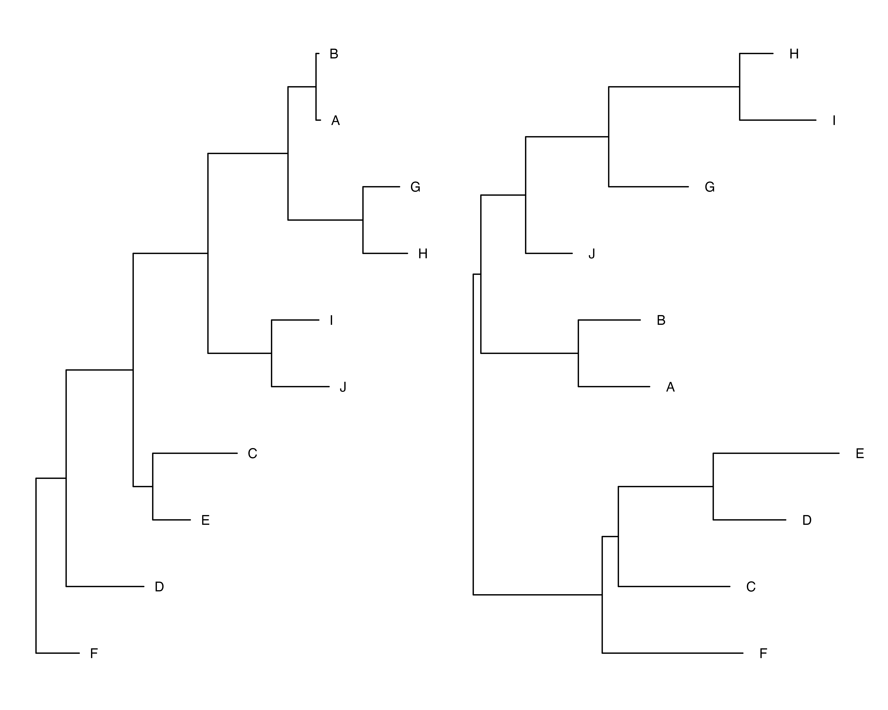
</div>

These are the trees we will be working with.<br>
Now let's save them.<br>

**_Input_**

```r
ggsave("../imgs/two_trees.png", two_trees, width = 10, height = 8, dpi = 600)
```

----------------------------------------------

### **Step 3: Rotate the 2nd tree**

Of course we can rotate the 2nd tree simply using `scale_x_reverse()`.<br>

**_Input_**

```r
# Rotate the 2nd tree
t2_rotated <- ggtree(tree2) + 
  geom_tiplab(offset = -.1) +
  scale_x_reverse()

# Combine the two plots side by side
two_trees_w_ro <- t1 + t2_rotated
two_trees_w_ro
```

**_Output_**

<div style='justify-content: center'>
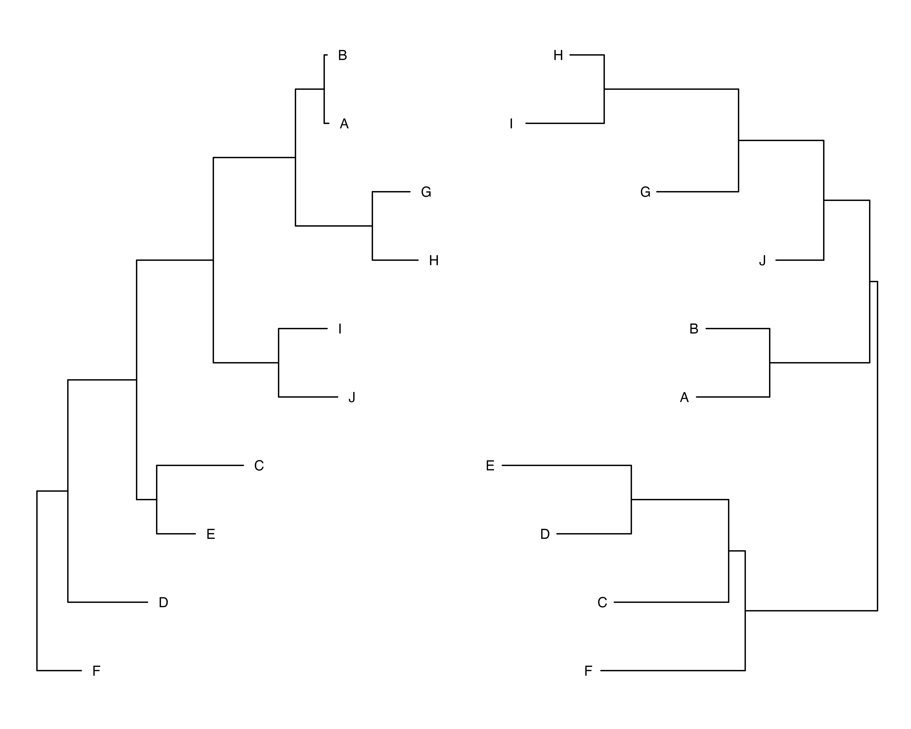
</div>

Let's save these trees.<br>

**_Input_**

```r
ggsave("../imgs/two_trees_w_ro.png", two_trees_w_ro, width = 10, height = 8, dpi = 600)
```

Looking good! But to manually create the tanglegram we need to adjust the coordinates of labels. And if we use `scale_x_reverse()` it will be impossible to make the tanglegram. That is why we need to go by more difficult and not obvious way - by manually horizontally mirroring the tree...<br>

Now we are going to grab the backend data frame from both trees and update the tree 2 data frame x-coordinate.<br>

**_Input_**

```r
data_tree_1 <- t1$data
data_tree_2 <- t2$data

data_tree_1$tree <-'t1'
data_tree_2$tree <-'t2'
```

And now we will use the `max(d2$x) - d2$x + max(d1$x) + max(d1$x)*0.3` equation to update x coordinates for the 2nd tree. This equation is not universal, `0.3` is not constant, you can fiddle with different values depending on the branch length unit of your tree to get good visualization.<br>

**_Input_**

```r
data_tree_2$x <- max(data_tree_2$x) - data_tree_2$x + max(data_tree_1$x) +  max(data_tree_1$x)*0.3
```

Now we display both trees with manually rotated 2nd tree.<br>

**_Input_**

```r
two_trees_w_ro_2 <- t1 +
  geom_tree(data=data_tree_2) +
  geom_tiplab(data = data_tree_2, offset = - 0.2)
two_trees_w_ro_2
```

**_Output_**

<div style='justify-content: center'>
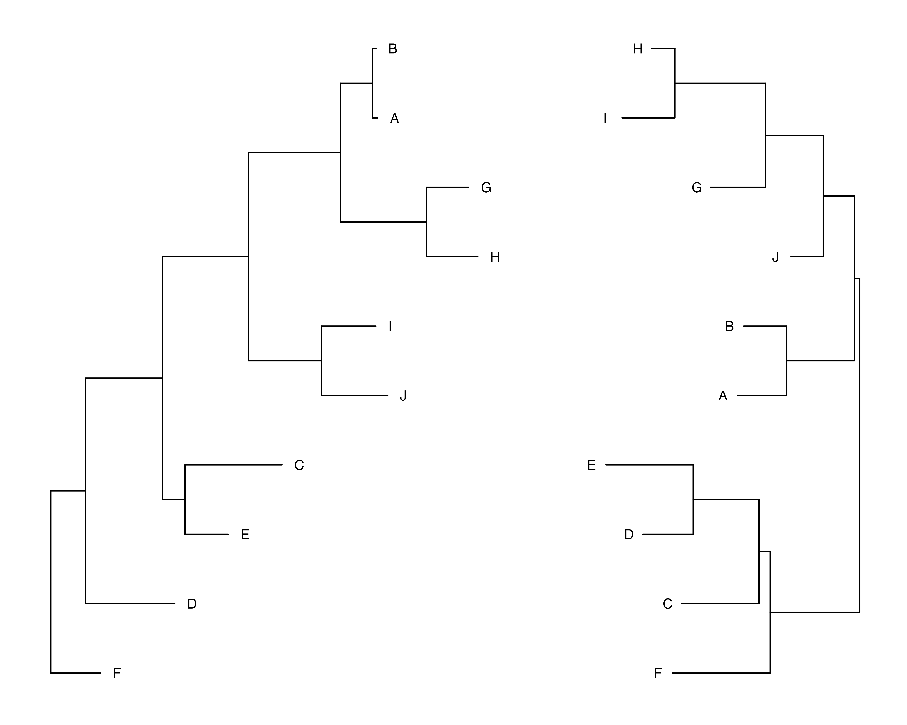
</div>

Looking same good! And let's save these twoo trees.<br>

**_Input_**

```r
ggsave("../imgs/two_trees_w_ro_2.png", two_trees_w_ro_2, width = 10, height = 8, dpi = 600)
```

----------------------------------------------

### **Step 4: Plotting the tanglegram**

Now let’s merge `data_tree_1` and `data_tree_2` to `data_combined` dataframe so that we can use the coordinates of the tips for making connections between both of the trees.<br>

**_Input_**

```r
data_combined <- bind_rows(data_tree_1, data_tree_2) %>% 
  filter(isTip == TRUE)
```

Now, we conditionally join the tips of both trees. Connected tips will represent the same isolates.<br>

**_Input_**

```r
ggtree_tanglegram_1 <- two_trees_w_ro_2 +
  geom_line(aes(x, y, group=label), data=data_combined, color='#009E73')

ggtree_tanglegram_1
```

**_Output_**

<div style='justify-content: center'>
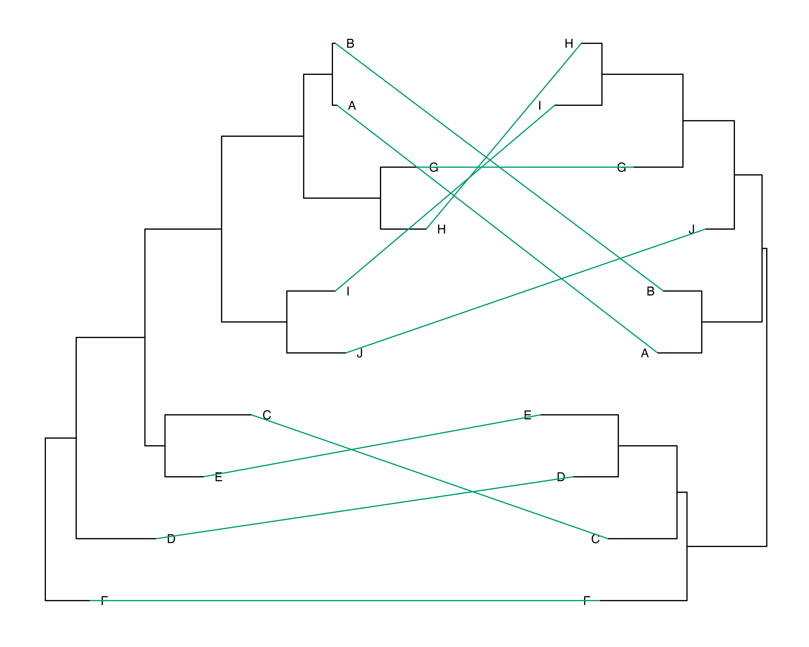
</div>

Hooray! Let's save this tanglegram. But... the connecting lines overlap the tip labels. Now we must solve this problem!<br>

**_Input_**

```r
ggsave("../imgs/ggtree_tanglegram_1.png", ggtree_tanglegram_1, width = 10, height = 8, dpi = 600)
```

Copy the `data_combined` dataset with coordinates and increase x coordinates for the 1st tree by 0.3 and decrease x coordinated for the 2nd tree by 0.3.<br>

**_Input_**

```r
data_combined_padding <- data_combined

data_combined_padding$x[data_combined_padding$tree == 't1'] <- data_combined_padding$x[data_combined_padding$tree == 't1'] + 0.3
data_combined_padding$x[data_combined_padding$tree == 't2'] <- data_combined_padding$x[data_combined_padding$tree == 't2'] - 0.3
```

Finally, let's make one last visualization.<br>

**_Input_**

```r
ggtree_tanglegram_2 <- two_trees_w_ro_2 +
  geom_line(aes(x, y, group=label), data=data_combined_padding, color='#009E73')

ggtree_tanglegram_2
```

**_Output_**

<div style='justify-content: center'>
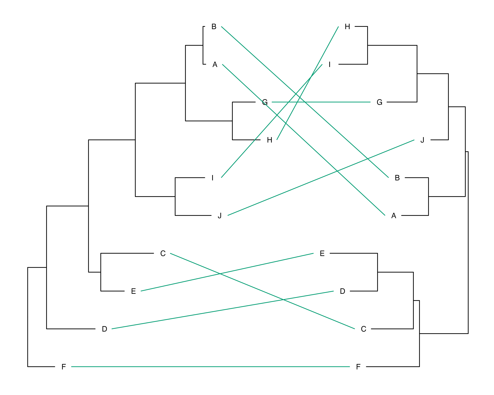
</div>

Just perfect! And let's save it.<br>

**_Input_**

```r
ggsave("../imgs/ggtree_tanglegram_2.png", ggtree_tanglegram_2, width = 10, height = 8, dpi = 600)
```

----------------------------------------------

## **Part 2: Tanglegram with `ape` and `cophyloplot()`**

### **Step 1: Preparation**

1st and the last step - install or call libraries.<br>

This time the preparation is simple - just install/call `ape` library.<br>

**_Input_**

```r
pacman::p_load(ape)
```

----------------------------------------------

### **Step 2: Small tanglegram**

Generate 2 small random phylogenetic trees.<br>

**_Input_**

```r
TreeA_S <- rtree(10)
TreeB_S <- rtree(10)
```

Now let's take a look at these trees.<br>

**_Input_**

```r
# Plot tree1 (left) and tree2 (right)
t1s <- ggtree(TreeA_S) + 
  geom_tiplab(offset = .1)

t2s <- ggtree(TreeB_S) + 
  geom_tiplab(offset = .1)

# Combine the two plots side by side
two_trees_s <- t1s + t2s
two_trees_s
```

**_Output_**

<div style='justify-content: center'>
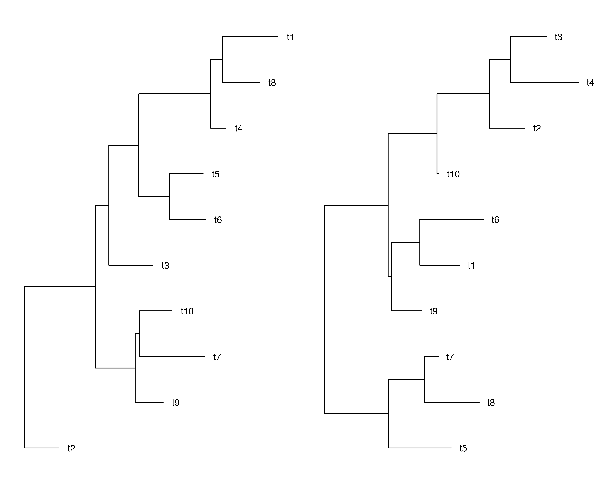
</div>

Interesting trees. Let's save them.<br>

**_Input_**

```r
ggsave("../imgs/two_trees_s.png", two_trees_s, width = 10, height = 8, dpi = 600)
```

Create the association matrix.<br>

**_Input_**

```r
association <- cbind(TreeB_S$tip.label, TreeB_S$tip.label)
```

Now let's display the tanglegram.<br>

**_Input_**

```r
cophyloplot(TreeA_S, TreeB_S, assoc = association, length.line = 4, space = 28, gap = 3)
```

**_Output_**

<div style='justify-content: center'>
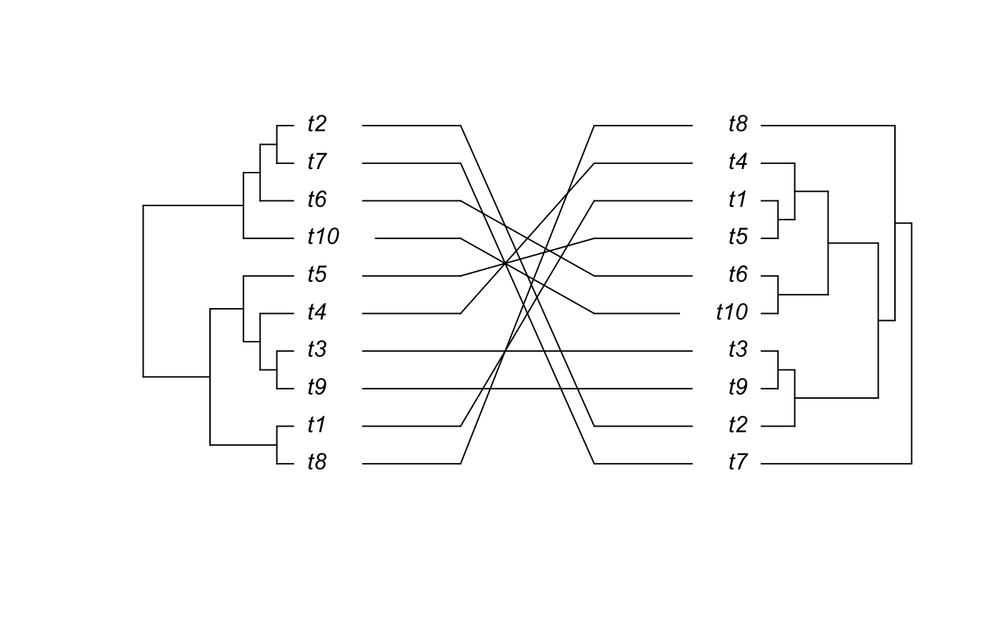
</div>

Wow! Let's save this plot.<br>

**_Input_**

```r
png("../imgs/ape_small_tanglegram.png", res = 600)
cophyloplot(TreeA_S, TreeB_S, assoc = association, length.line = 4, space = 28, gap = 3)
dev.off()
```

----------------------------------------------

### **Step 3: Large tanglegram**

`cophyloplot()` function of `ape` package workid just fine for the small trees. But will it work for large trees! Let's find it out!<br>

Generate 2 large random phylogenetic trees.<br>

**_Input_**

```r
TreeA_L <- rtree(100)
TreeB_L <- rtree(100)
```

Now let's take a look at these trees.<br>

**_Input_**

```r
# Plot tree1 (left) and tree2 (right)
t1l <- ggtree(TreeA_L) + 
  geom_tiplab(size = 1.5, offset = .1)

t2l <- ggtree(TreeB_L) + 
  geom_tiplab(size = 1.5, offset = .1)

# Combine the two plots side by side
two_trees_l <- t1l + t2l
two_trees_l
```

**_Output_**

<div style='justify-content: center'>
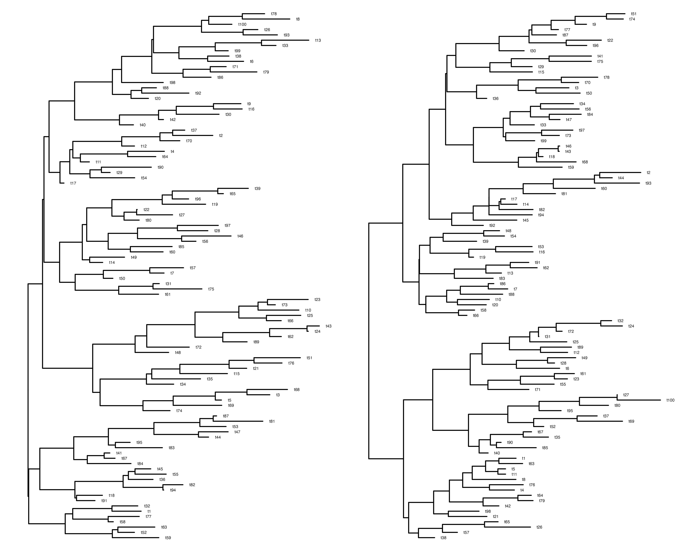
</div>

Wow! Suppose `cophyloplot()` will not do good with such a large trees. Anyway let's save them.<br>

**_Input_**

```r
ggsave("../imgs/two_trees_l.png", two_trees_l, width = 10, height = 8, dpi = 600)
```

Create the association matrix.<br>

**_Input_**

```r
association <- cbind(TreeB_L$tip.label, TreeB_L$tip.label)
```

Now let's display the tanglegram.<br>

**_Input_**

```r
cophyloplot(TreeA_L, TreeB_L, assoc = association, length.line = 4, space = 28, gap = 3)
```

**_Output_**

<div style='justify-content: center'>
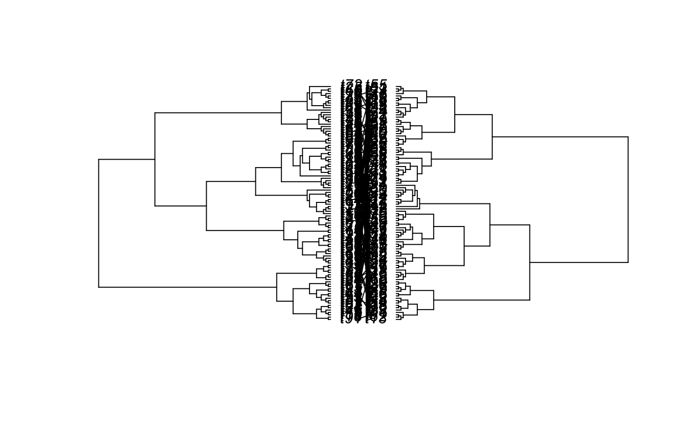
</div>

That looks awful... Anyway let's save it...<br>

**_Input_**

```r
png("../imgs/ape_large_tanglegram.png", res = 600)
cophyloplot(TreeA_L, TreeB_L, assoc = association, length.line = 4, space = 28, gap = 3)
dev.off()
```

----------------------------------------------

## **Part 3: Tanglegram with `dendextend`**

>For more guides `dendextend` package please visit [official guide](https://cran.r-project.org/web/packages/dendextend/vignettes/dendextend.html)

How do we make large tanglegram look good? Use `dendextend`!<br>

### **Step 1: Preparation**

1st and the last step - install or call libraries.<br>

This time the preparation is also simple - just install/call `dendextend` library.<br>

**_Input_**

```r
pacman::p_load(dendextend)
```

Set another seed to make the trees look different.<br>

**_Input_**

```r
set.seed(42)
```

----------------------------------------------

### **Step 2: Creating dendrograms**

`tanglegram` function in `dendextend` package uses `ultrametric` trees. That's why to generate 2 large random phylogenetic trees we will use `rcoal()` function.<br>

**_Input_**

```r
TreeA_L_2 <- rcoal(100)
TreeB_L_2 <- rcoal(100)
```

Now let's take a look at these trees.<br>

**_Input_**

```r
# Plot tree1 (left) and tree2 (right)
t1l2 <- ggtree(TreeA_L_2) + 
  geom_tiplab(size = 1.5, offset = .1)

t2l2 <- ggtree(TreeB_L_2) + 
  geom_tiplab(size = 1.5, offset = .1)

# Combine the two plots side by side
two_trees_l_2 <- t1l2 + t2l2
two_trees_l_2
```

**_Output_**

<div style='justify-content: center'>
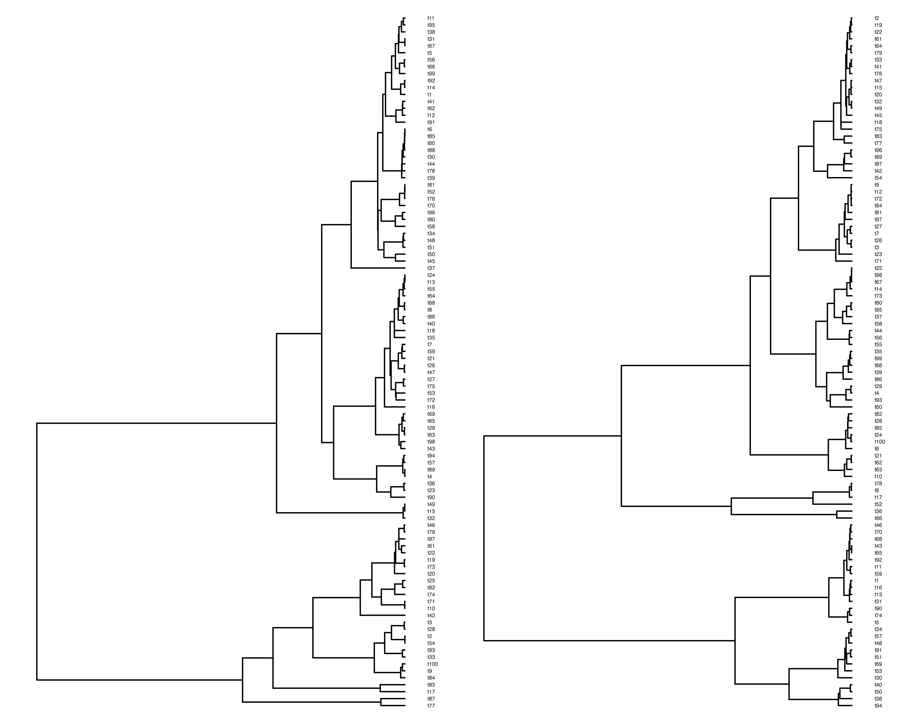
</div>

Yeah. Looking massive. Save it.<br>

**_Input_**

```r
ggsave("../imgs/two_trees_l_2.png", two_trees_l_2, width = 10, height = 8, dpi = 600)
```

----------------------------------------------

### **Step 3: Plotting tanglegram**

Now let's use `tanglegram` function!<br>

**_Input_**

```r
tanglegram(TreeA_L_2, TreeB_L_2,
           sort = TRUE,
           common_subtrees_color_lines = FALSE,
           highlight_distinct_edges  = FALSE,
           highlight_branches_lwd = FALSE)
```

**_Output_**

<div style='justify-content: center'>
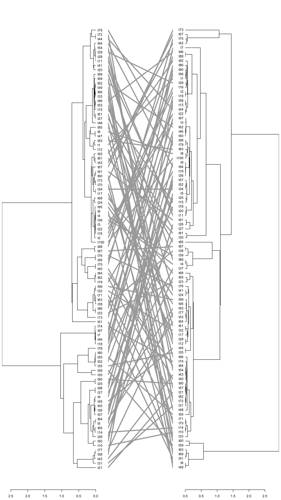
</div>

Finally! That large tanglegram looks great! Let's save it.<br>

**_Input_**

```r
png("../imgs/dendextend_large_tanglegram.png", width = 9, height = 16, res = 600)
tanglegram(TreeA_L_2, TreeB_L_2,
           sort = TRUE,
           common_subtrees_color_lines = FALSE,
           highlight_distinct_edges  = FALSE,
           highlight_branches_lwd = FALSE)
dev.off()
```