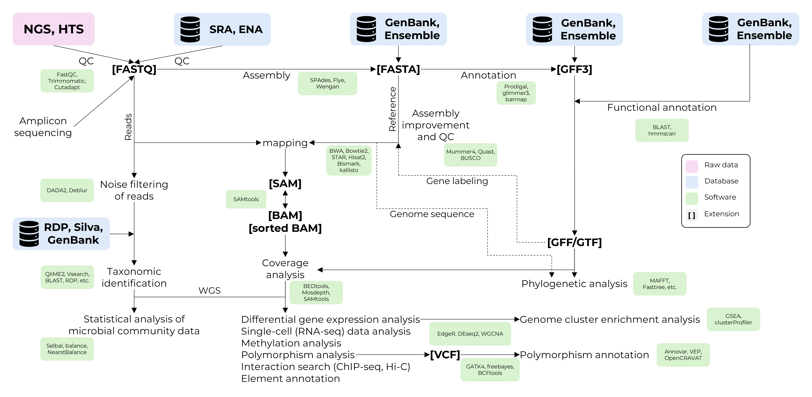

---
hide:
  - toc
icon: lucide/house
---
# **Introduction**

<figure markdown="span">
  { width="50%" }
</figure>

Welcome to the handbook on NGS data analysis! 
Once this was the library of manuals I used in work. Then I decided to deploy a website to make it more convenient to use. The best part of it that now anyone can use it too! Please enjoy! 

----------------------------------------------

_Typical workflow of NGS data analysis_

----------------------------------------------

## **05 16S Amplicon Analysis 🧫**

In the [16S amplicon analysis chapter](16S_amplicon_analysis/index.md) there is an introductory guide on conducting analysis using `DADA2` followed by two interesting examples of "real-life" analysis pipeline with the data from studies on Crohn's and Parkinson's diseases.

----------------------------------------------

## **04 Phylogenetics 🌳**

In the [Phylogenetics chapter](Phylogenetics/index.md) there is a complete pipeline of simple research in phylogenetics, from working with NCBI (and other databases) to building trees, evaluating them, and getting some worthwhile results.

----------------------------------------------

## **03 Whole Genome and Pangenome Analyses 🧬**

In the [Whole (pan)genome chapter](Pangenome/index.md) there is a pipeline of whole genome and pangenome analyses with `PanACoTA` pipeline which includes genomes filtering with `mash`, annotating with `prokka` & `prodigal`, pangenome building with `mmseqs`, core genomes alignment with `mafft` and finally building phylogenetic tree with `iq-tree`.

----------------------------------------------

## **02 Genomic Variation Analysis 🔬**

In the [Genomic Variation Analysis chapter](VarCall/index.md) there is a detailed guide how to conduct studies on Variant Calling using `fastqc`, `trimmomatic`, `bwa`, `samtools`, `abra2`, `bcftools`, `snpEff` & `SnpSift`.

----------------------------------------------

## **01 Quality Control of Raw Data 💎**

In the [Quality Control chapter](QC/index.md) there is a detailed guide how to conduct quality control of raw data using `fastqc` and `trimmomatic`.